# CCH (Claude Code Harness) v2 - Workflow Diagrams

> 전체 워크플로우 시각화 문서. 각 섹션에 Mermaid 다이어그램 포함.
> 버전: v2.1 | 갱신일: 2026-03-04

---

## 1. Master System Overview

전체 CCH v2 시스템의 구성요소와 상호 연결.

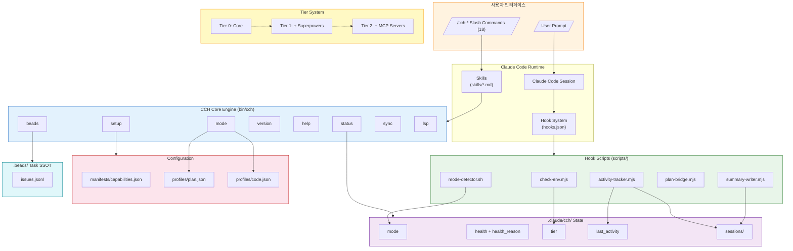

---

## 2. Plugin Bootstrap & Setup

CCH 플러그인 초기 셋업 워크플로우.

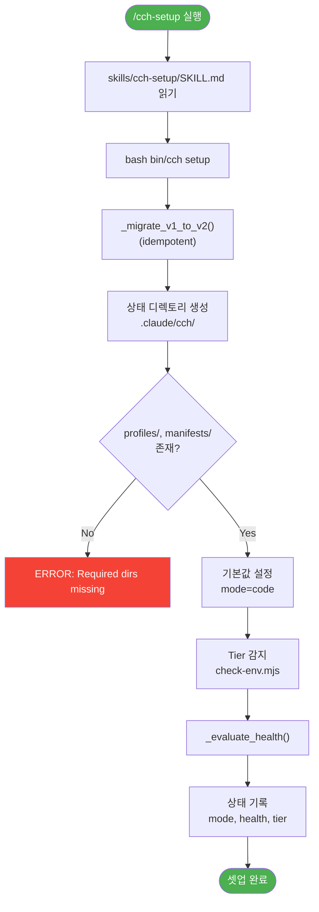

---

## 3. Mode Switching (plan / code)

2-모드 전환 및 자동 감지 워크플로우.

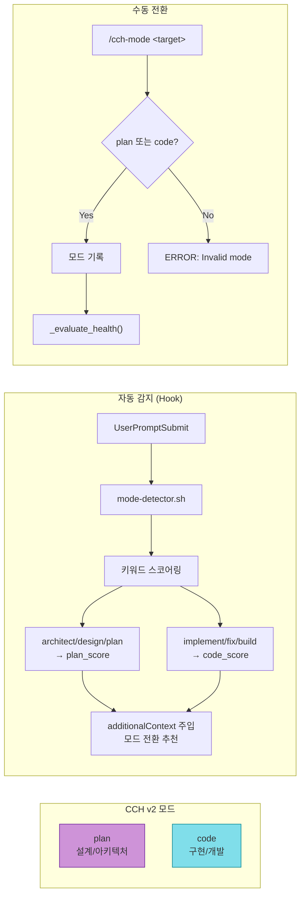

---

## 4. Tier System & Health Evaluation

환경 기반 Tier 감지 및 헬스 평가.

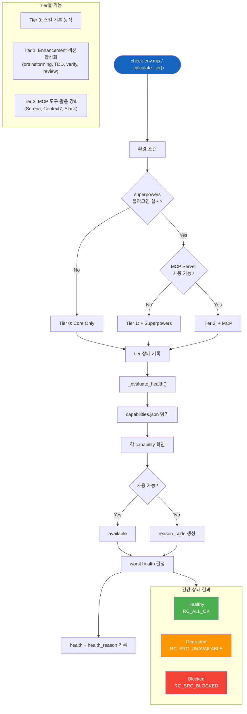

---

## 5. Hook Event Pipeline

Claude Code 라이프사이클 이벤트에 연결된 후크 실행 파이프라인.

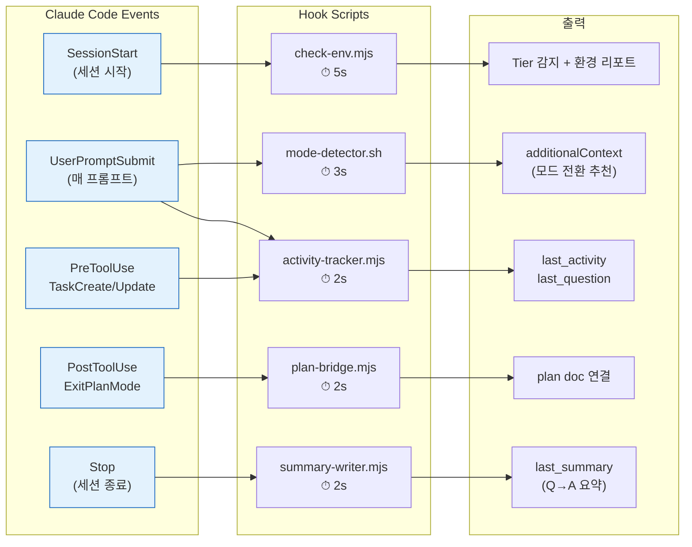

---

## 6. Activity Tracker State Machine

활동 추적기의 이벤트별 상태 전이.

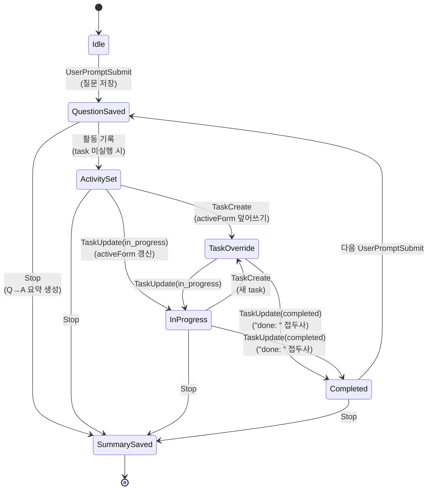

---

## 7. Beads Task Tracking

프로젝트 수준 태스크 추적 시스템 (SSOT).

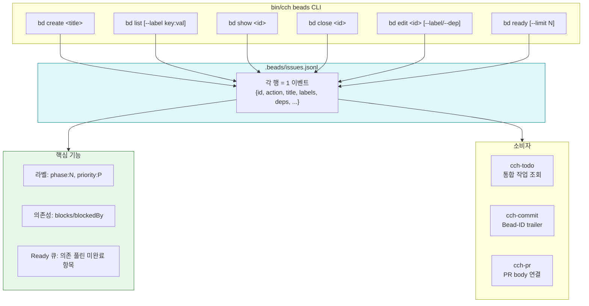

---

## 8. Commit Workflow

논리적 분할 커밋 워크플로우.

---

## 9. Pull Request Workflow

Beads 연결 PR 생성 워크플로우.

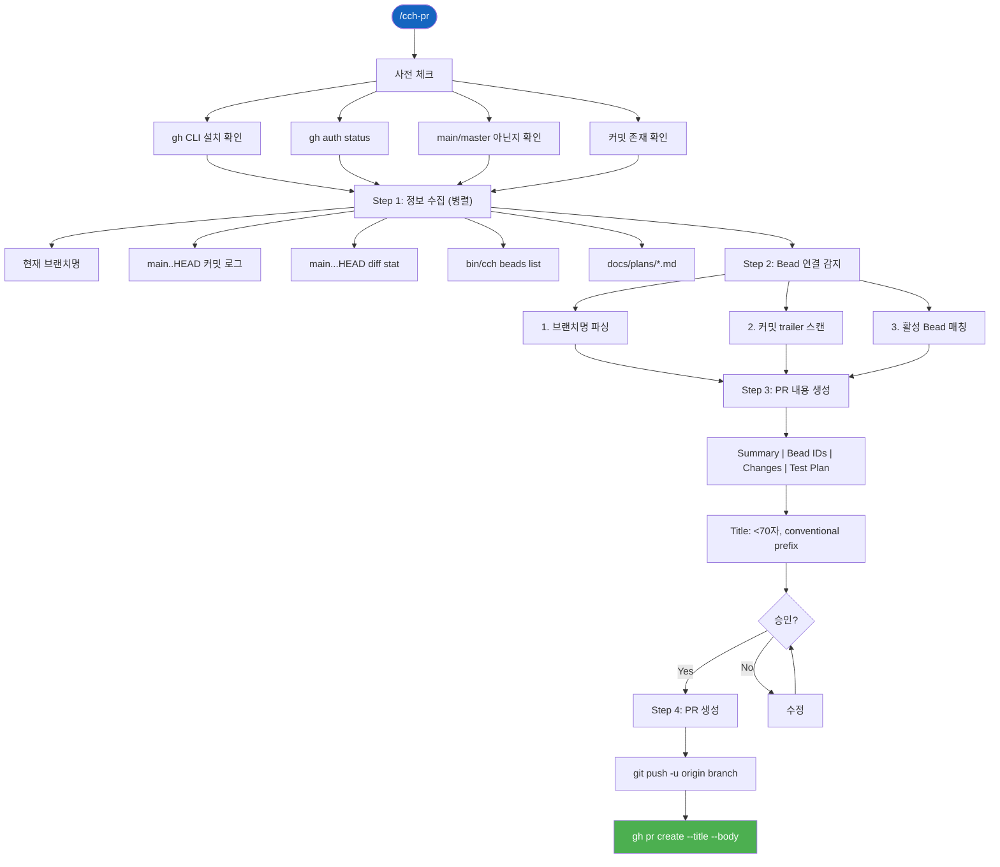

---

## 10. Team Pipeline (Dev → Test → Verify)

멀티 에이전트 순차 실행 파이프라인.

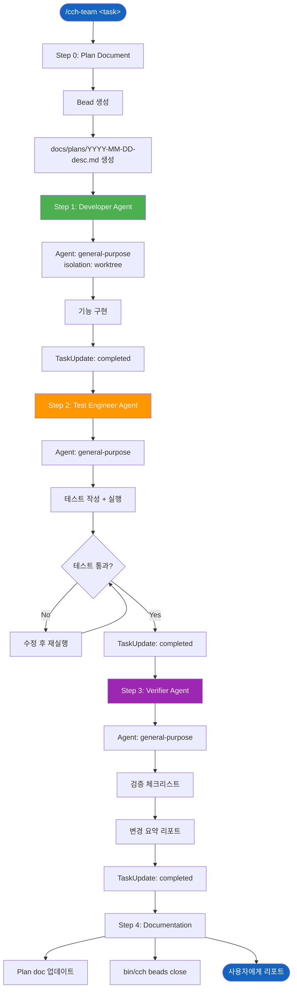

---

## 11. Test Architecture

7개 테스트 파일, 201+ 테스트.

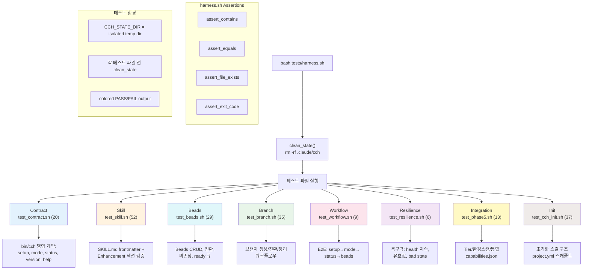

---

## 12. System Interconnection Diagram

모든 워크플로우 간의 상호 연결 맵.

```mermaid
graph TB
    subgraph UserActions["사용자 액션"]
        UA1["/cch-setup"]
        UA2["/cch-mode"]
        UA3["/cch-commit"]
        UA4["/cch-pr"]
        UA5["/cch-team"]
        UA6["/cch-todo"]
        UA7["/cch-verify"]
        UA8["/cch-review"]
        UA9["/cch-status"]
    end

    subgraph AutoActions["자동 액션 (Hooks)"]
        AA0["check-env.mjs"]
        AA1["mode-detector.sh"]
        AA2["activity-tracker.mjs"]
        AA3["plan-bridge.mjs"]
        AA4["summary-writer.mjs"]
    end

    subgraph Engine["Core Engine (bin/cch)"]
        ENG_SETUP["setup"]
        ENG_MODE["mode"]
        ENG_STATUS["status"]
        ENG_BEADS["beads"]
        ENG_SYNC["sync"]
        ENG_LSP["lsp"]
    end

    subgraph State["State (.claude/cch/)"]
        ST["mode | health | tier<br/>health_reason | last_activity<br/>sessions/ | locks/"]
    end

    subgraph Beads["Beads (.beads/)"]
        BD["issues.jsonl"]
    end

    subgraph Config["Config"]
        CFG["capabilities.json<br/>plan.json | code.json"]
    end

    UA1 --> ENG_SETUP
    UA2 --> ENG_MODE
    UA3 -.-> ENG_BEADS
    UA4 -.-> ENG_BEADS
    UA5 --> ENG_BEADS
    UA6 --> ENG_BEADS
    UA9 --> ENG_STATUS

    ENG_SETUP --> CFG
    ENG_MODE --> CFG
    ENG_STATUS --> ST
    ENG_BEADS --> BD

    AA0 --> ST
    AA1 --> ST
    AA2 --> ST
    AA4 --> ST

    style UserActions fill:#E3F2FD,stroke:#1565C0
    style AutoActions fill:#E8F5E9,stroke:#2E7D32
    style Engine fill:#FFF3E0,stroke:#F57C00
    style State fill:#F3E5F5,stroke:#6A1B9A
    style Beads fill:#E0F7FA,stroke:#00838F
    style Config fill:#FCE4EC,stroke:#C62828
```
