# CCH (Claude Code Harness) v2 — Skill & Workflow Reference

> 전체 스킬 카탈로그, 워크플로우, 의존성 맵 시각화 문서
> 버전: v2.2 | 갱신일: 2026-03-04

---

## 1. Skill Catalog (18 Skills)

### 1.1 카테고리별 분류

```mermaid
graph TB
    subgraph Core["Core Skills (8)"]
        direction TB
        S_SETUP["cch-setup<br/>환경 초기화"]
        S_PLAN["cch-plan<br/>설계→플래닝→TODO"]
        S_COMMIT["cch-commit<br/>논리 단위 커밋"]
        S_TODO["cch-todo<br/>통합 작업 조회"]
        S_VERIFY["cch-verify<br/>구현 검증"]
        S_REVIEW["cch-review<br/>코드 리뷰"]
        S_STATUS["cch-status<br/>헬스 상태"]
        S_PR["cch-pr<br/>PR 생성"]
    end

    subgraph Init["Init Skills (4)"]
        direction TB
        S_INIT["cch-init<br/>통합 파이프라인"]
        S_SCAN["cch-init-scan<br/>프로젝트 스캔"]
        S_DOCS["cch-init-docs<br/>문서 생성"]
        S_SCAFFOLD["cch-init-scaffold<br/>구조 스캐폴딩"]
    end

    subgraph Utility["Utility Skills (6)"]
        direction TB
        S_TEAM["cch-team<br/>Dev→Test→Verify"]
        S_PIPE["cch-full-pipeline<br/>E2E 파이프라인"]
        S_ARCH["cch-arch-guide<br/>아키텍처 레벨"]
        S_EXCALI["cch-excalidraw<br/>다이어그램 생성"]
        S_LSP["cch-lsp<br/>LSP 설치/관리"]
        S_PINCH["cch-pinchtab<br/>웹 UI 테스트"]
    end

    style Core fill:#E3F2FD,stroke:#1565C0
    style Init fill:#E8F5E9,stroke:#2E7D32
    style Utility fill:#FFF3E0,stroke:#F57C00
```

### 1.2 전체 스킬 목록

| # | 스킬 | 카테고리 | 설명 | user-invocable | Enhancement |
|---|------|---------|------|:-:|:-:|
| 1 | `cch-setup` | Core | 환경 초기화, 경로/권한 확인, Tier 감지 | O | O |
| 2 | `cch-plan` | Core | 설계(인터뷰) → 플래닝 → TODO 통합 워크플로우 | O | O |
| 3 | `cch-commit` | Core | 변경사항 분석 → 논리 단위 그룹화 → Bead 트레일러 커밋 | O | O |
| 4 | `cch-todo` | Core | Beads(SSOT) + TaskList 통합 작업 조회 | O | O |
| 5 | `cch-verify` | Core | 테스트 실행, 출력 확인, 스펙 대비 검증 | O | O |
| 6 | `cch-review` | Core | 코드 리뷰 체크리스트 + 서브에이전트 디스패치 | O | O |
| 7 | `cch-status` | Core | 모드/Tier/헬스 상태 표시 | O | - |
| 8 | `cch-pr` | Core | Beads 연동 PR 생성 + 선택적 Merge & Cleanup | O | - |
| 9 | `cch-init` | Init | 스캔→문서→스캐폴딩 통합 파이프라인 | O | - |
| 10 | `cch-init-scan` | Init | 메타데이터/구조/문서/git/아키텍처 스캔 | - | - |
| 11 | `cch-init-docs` | Init | Architecture/PRD/Roadmap 문서 역산 생성 | - | - |
| 12 | `cch-init-scaffold` | Init | 디렉터리/매니페스트/프로필/훅 스캐폴딩 | - | - |
| 13 | `cch-team` | Utility | Dev→Test→Verify 멀티에이전트 파이프라인 | O | - |
| 14 | `cch-full-pipeline` | Utility | PRD→팀빌딩→병렬구현→검증→딜리버리 E2E | O | - |
| 15 | `cch-arch-guide` | Utility | 복잡도 인터뷰 → 아키텍처 레벨 결정/스캐폴딩 | O | - |
| 16 | `cch-excalidraw` | Utility | Excalidraw 다이어그램 생성 (CCH 컨텍스트 주입) | O | - |
| 17 | `cch-lsp` | Utility | LSP 서버 감지/설치/Serena 설정 | O | - |
| 18 | `cch-pinchtab` | Utility | PinchTab 기반 웹 UI 디버깅/테스트 | O | - |

---

## 2. Skill Dependency Graph

스킬 간 호출/참조 관계.

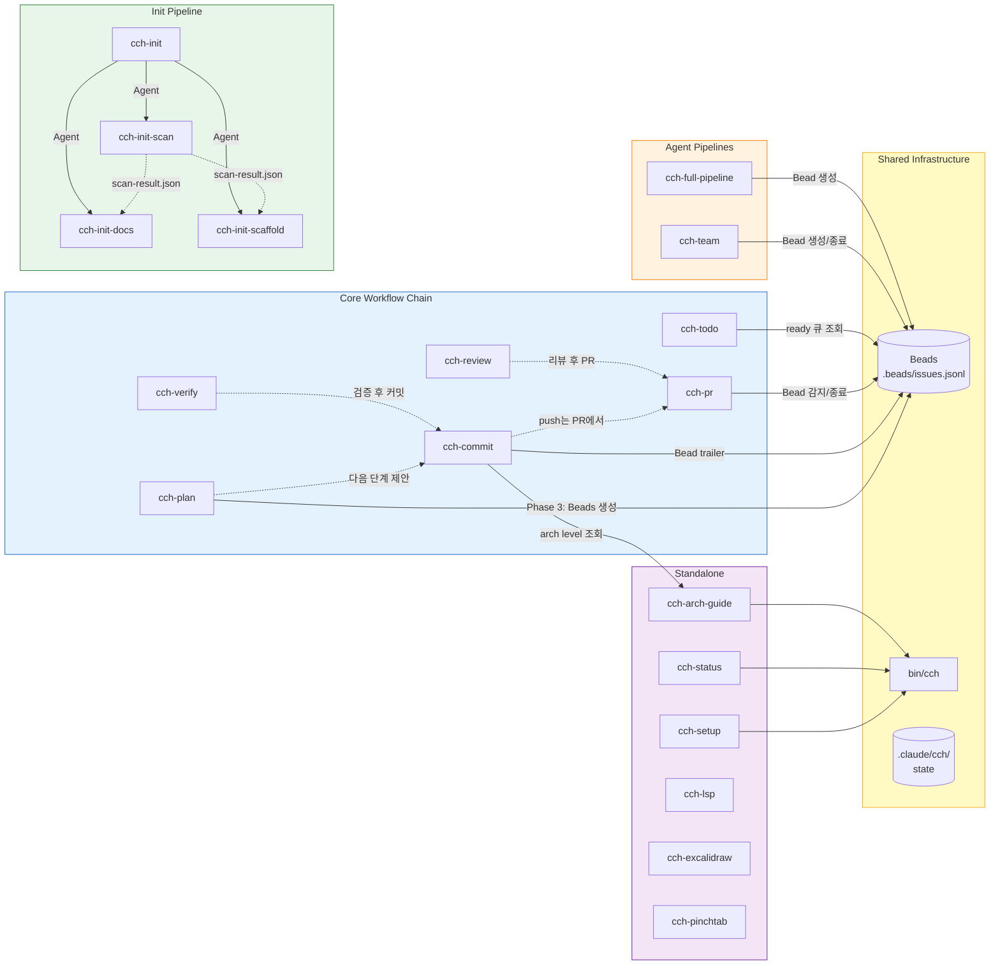

---

## 3. Tier System & Enhancement

### 3.1 Tier 감지 흐름

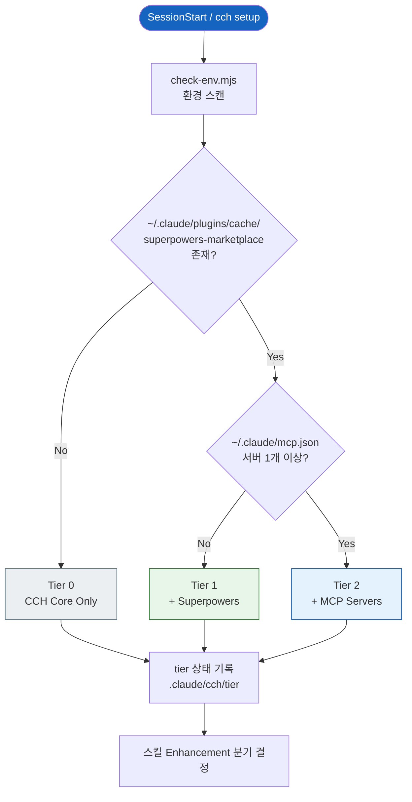

### 3.2 Enhancement 통합 매트릭스

각 스킬이 Tier 1+에서 어떤 Superpowers를 흡수하는지:

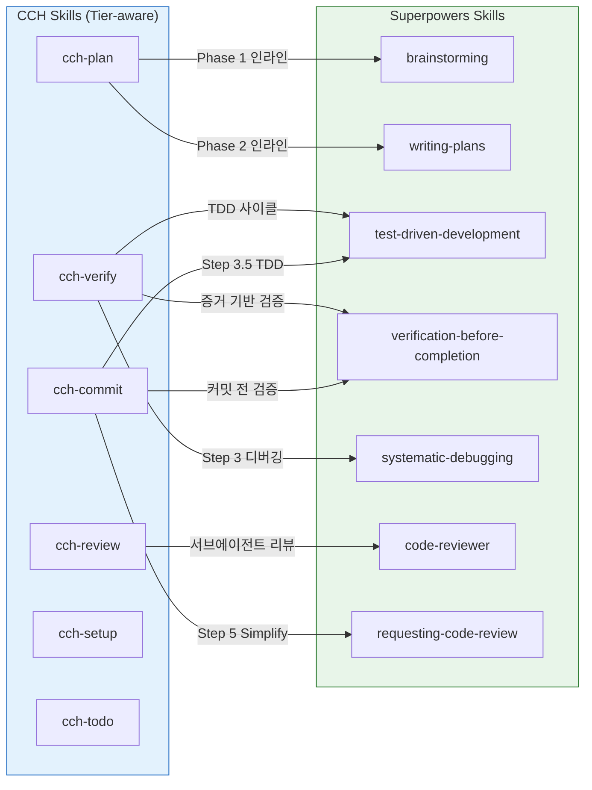

| CCH 스킬 | Superpowers 흡수 | 강화 내용 |
|----------|-----------------|-----------|
| `cch-plan` | `brainstorming`, `writing-plans` | Phase 1 설계 인터뷰 + Phase 2 TDD 플랜 인라인 수행 |
| `cch-commit` | `test-driven-development`, `requesting-code-review`, `verification-before-completion` | TDD 사전 체크, Simplify 코드 리뷰 관점, 커밋 전 검증 |
| `cch-verify` | `verification-before-completion`, `systematic-debugging`, `test-driven-development` | 증거 기반 검증, 구조적 디버깅, TDD 사이클 지원 |
| `cch-review` | `code-reviewer` | 서브에이전트 기반 심층 코드 분석 (실패 시 기본 체크리스트 폴백) |
| `cch-setup` | - | Tier 1+ 시 Superpowers 스킬 목록 표시, Tier 2+ 시 MCP 서버 목록 표시 |
| `cch-todo` | - | Tier 정보 인라인 표시, 적절한 Superpowers 스킬 추천 |

---

## 4. Hook Event Pipeline

Claude Code 라이프사이클 이벤트에 연결된 후크 파이프라인.

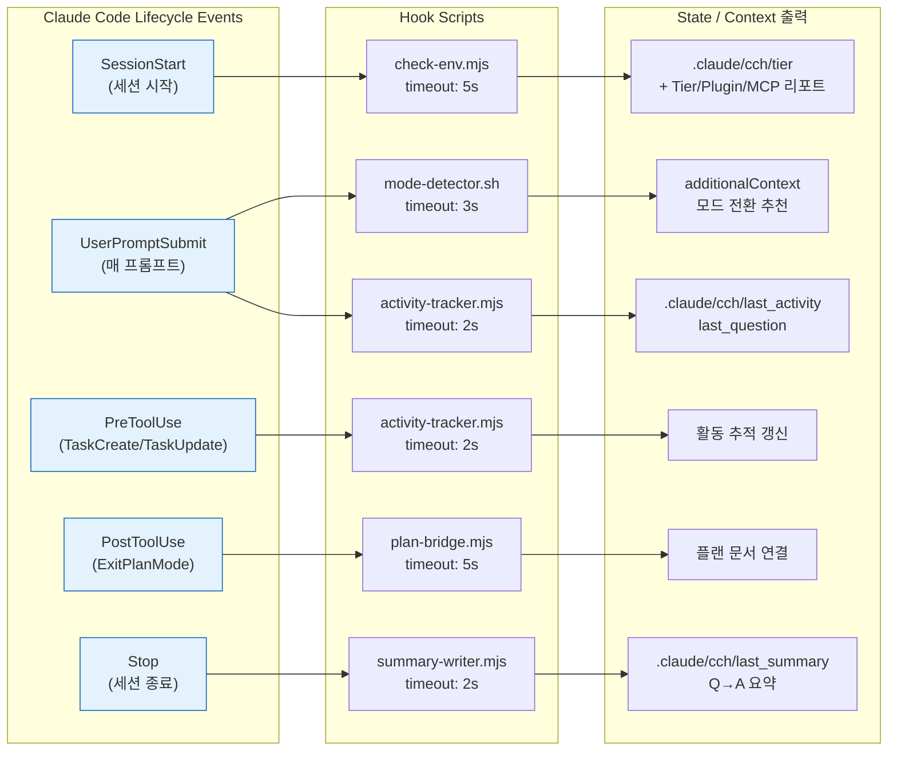

---

## 5. Mode System (plan / code)

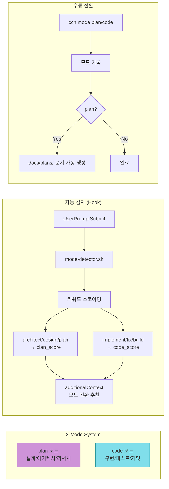

---

## 6. Core Workflow: Plan → Code → Commit → PR

전체 개발 라이프사이클.

```mermaid
flowchart TD
    START(["기능 요청"]) --> PLAN

    subgraph PLAN_PHASE["Phase 1: /cch-plan"]
        PLAN["Smart Entry<br/>(입력 분석)"]
        PLAN --> P1["Phase 1: Design<br/>인터뷰 + 설계 문서"]
        P1 --> P2["Phase 2: Plan<br/>TDD Task 분해"]
        P2 --> P3["Phase 3: TODO Sync<br/>Beads 생성 + TaskList"]
    end

    P3 --> IMPL

    subgraph CODE_PHASE["Phase 2: 구현"]
        IMPL["구현 시작"]
        IMPL --> OPT_A["옵션 A: cch-team<br/>(Dev→Test→Verify)"]
        IMPL --> OPT_B["옵션 B: 수동 구현<br/>(직접 코드 작성)"]
    end

    OPT_A & OPT_B --> VERIFY_PHASE

    subgraph VERIFY_PHASE_BOX["Phase 3: /cch-verify"]
        VERIFY_PHASE["테스트 실행 + 검증"]
        VERIFY_PHASE --> PASS{"VERIFIED?"}
        PASS -->|No| DEBUG["실패 분석<br/>(systematic debugging)"]
        DEBUG --> VERIFY_PHASE
        PASS -->|Yes| VERIFIED["검증 완료"]
    end

    VERIFIED --> COMMIT_PHASE

    subgraph COMMIT_PHASE_BOX["Phase 4: /cch-commit"]
        COMMIT_PHASE["변경사항 수집"]
        COMMIT_PHASE --> ANALYZE["논리 단위 그룹화"]
        ANALYZE --> TDD_CHECK["TDD Pre-Check"]
        TDD_CHECK --> USER_CONFIRM["사용자 승인"]
        USER_CONFIRM --> EXECUTE["순차 커밋 실행"]
        EXECUTE --> SIMPLIFY["Simplify + README"]
    end

    SIMPLIFY --> REVIEW_PHASE

    subgraph REVIEW_PHASE_BOX["Phase 5: /cch-review"]
        REVIEW_PHASE["코드 리뷰"]
        REVIEW_PHASE --> CHECKLIST["체크리스트<br/>(기능/품질/안전/테스트)"]
        CHECKLIST --> RESULT{"APPROVED?"}
        RESULT -->|No| FIX["수정 필요"]
        RESULT -->|Yes| APPROVED["리뷰 통과"]
    end

    APPROVED --> PR_PHASE

    subgraph PR_PHASE_BOX["Phase 6: /cch-pr"]
        PR_PHASE["PR 내용 생성"]
        PR_PHASE --> BEAD_LINK["Bead 연동"]
        BEAD_LINK --> GH_PR["gh pr create"]
        GH_PR --> MERGE_OPT["선택: PR만 / Merge+Cleanup"]
    end

    MERGE_OPT --> DONE(["완료"])

    style START fill:#1565C0,color:white
    style DONE fill:#4CAF50,color:white
    style PLAN_PHASE fill:#F3E5F5,stroke:#6A1B9A
    style CODE_PHASE fill:#E8F5E9,stroke:#2E7D32
    style VERIFY_PHASE_BOX fill:#FFF3E0,stroke:#F57C00
    style COMMIT_PHASE_BOX fill:#E3F2FD,stroke:#1565C0
    style REVIEW_PHASE_BOX fill:#FCE4EC,stroke:#C62828
    style PR_PHASE_BOX fill:#E0F7FA,stroke:#00838F
```

---

## 7. cch-plan 상세 워크플로우

가장 복잡한 Core 스킬의 내부 흐름.

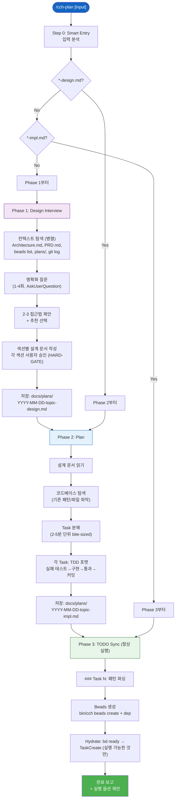

---

## 8. cch-commit 상세 워크플로우

논리 단위 분할 커밋 + 후처리.

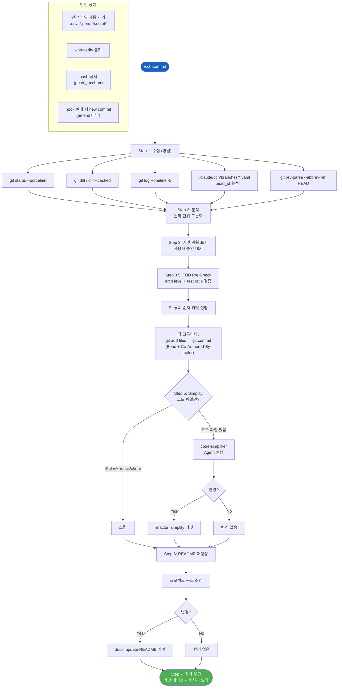

---

## 9. cch-pr 워크플로우

Beads 연결 PR 생성 + 선택적 Merge.

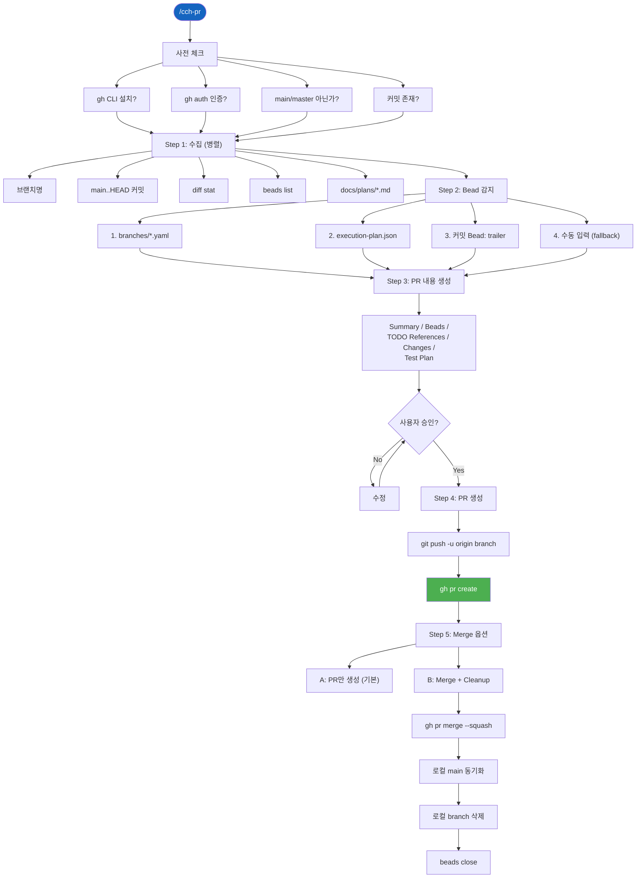

---

## 10. cch-team 파이프라인

Dev → Test → Verify 멀티에이전트 순차 실행.

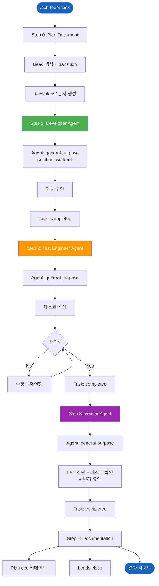

---

## 11. cch-init 파이프라인

프로젝트 분석 → 문서 생성 → 스캐폴딩.

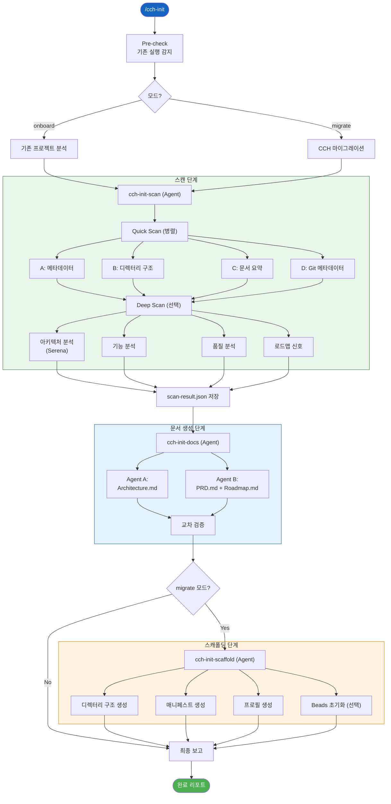

---

## 12. cch-full-pipeline (E2E)

PRD 인터뷰 → 팀 빌딩 → 병렬 구현 → 합의 검증 → 딜리버리.

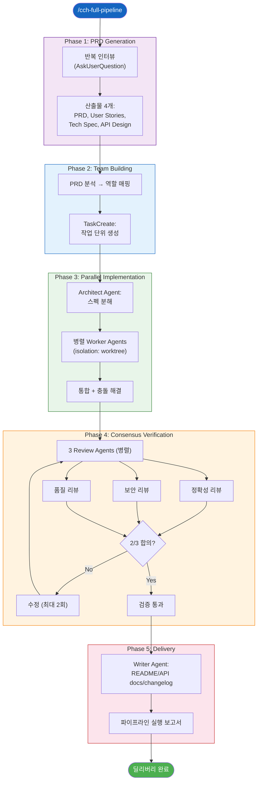

---

## 13. Beads Task Tracking

프로젝트 수준 태스크 SSOT.

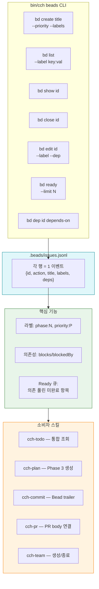

---

## 14. cch-verify + cch-review 품질 게이트

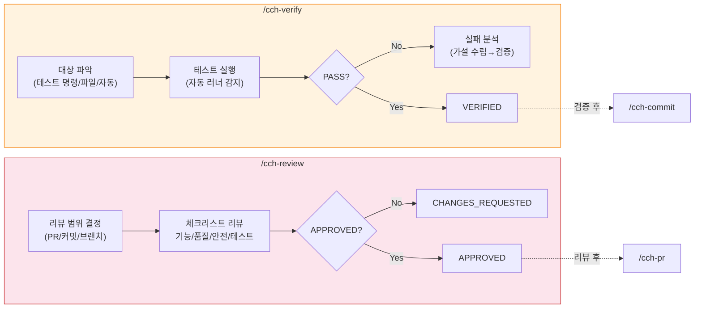

---

## 15. Activity Tracker State Machine

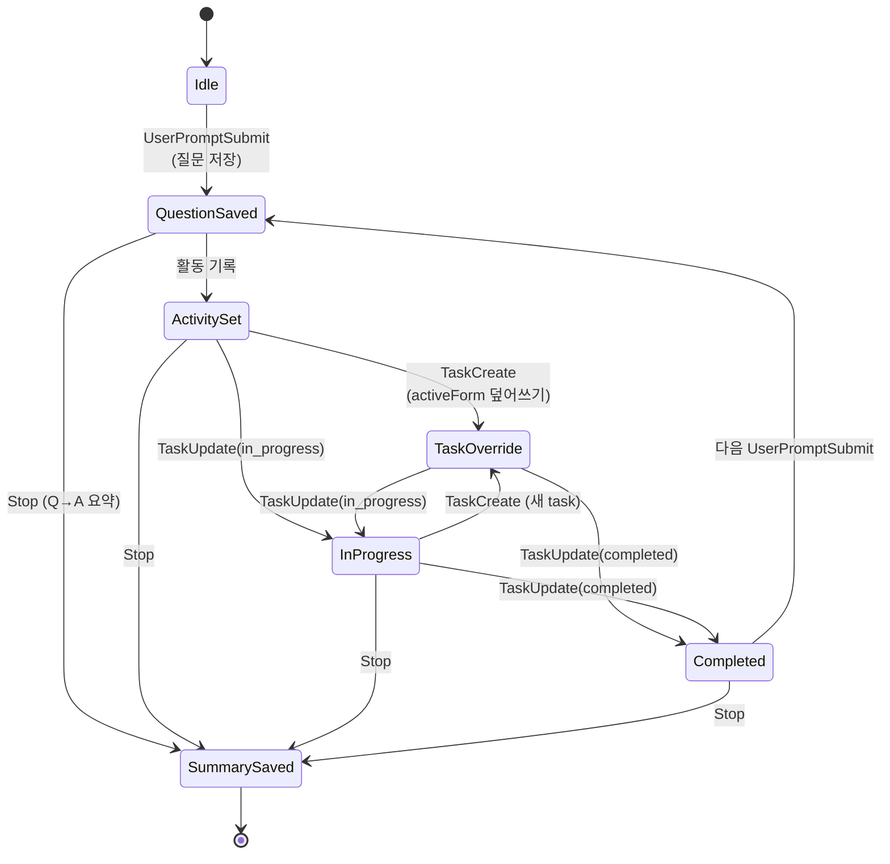

---

## 16. System Architecture Overview

전체 레이어와 상호 연결.

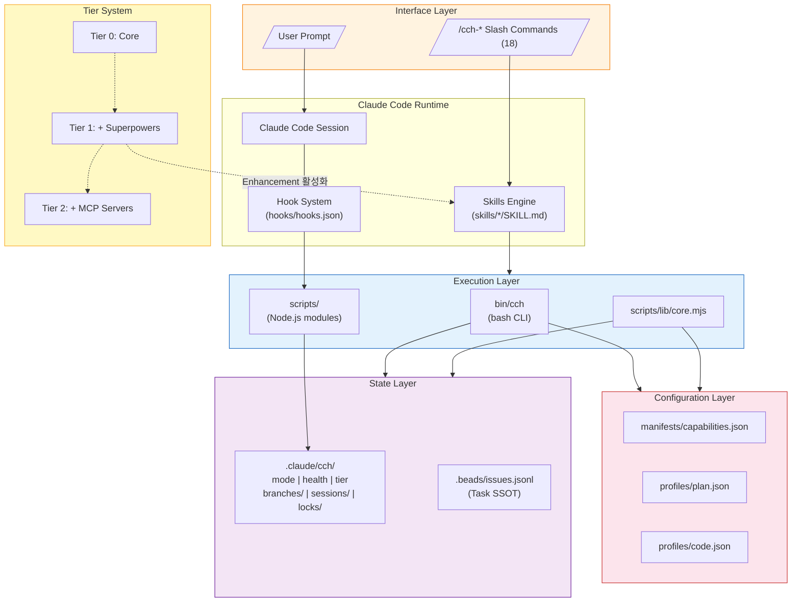

---

## 17. Test Architecture

8개 테스트 파일, 201+ 테스트.

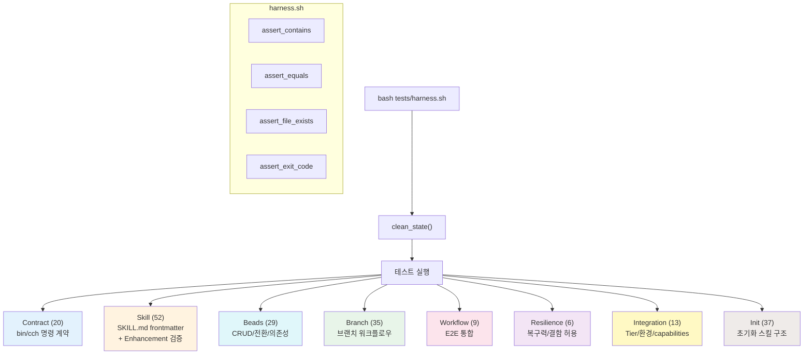

---

## 18. File Map

### Core Engine

| 파일 | 역할 |
|------|------|
| `bin/cch` | CLI 엔진 — 명령 파싱/디스패치, 모드 전환, Tier 감지, 마이그레이션 |
| `bin/lib/beads.sh` | Beads CRUD/전환/의존성/조회 |
| `bin/lib/branch.sh` | 브랜치 워크플로우 관리 |
| `bin/lib/log.sh` | 실행 로그 기록/조회 |
| `bin/lib/lock.sh` | 동시성 제어 (락 파일) |

### Scripts

| 파일 | 역할 | 트리거 |
|------|------|--------|
| `scripts/check-env.mjs` | 환경 스캔 + Tier 감지 | SessionStart Hook |
| `scripts/mode-detector.sh` | plan/code 모드 추천 | UserPromptSubmit Hook |
| `scripts/activity-tracker.mjs` | 활동 추적 | UserPromptSubmit, PreToolUse Hook |
| `scripts/plan-bridge.mjs` | 플랜 문서 연결 | PostToolUse(ExitPlanMode) Hook |
| `scripts/summary-writer.mjs` | 세션 요약 생성 | Stop Hook |
| `scripts/lib/core.mjs` | JSON 파싱, 상태 R/W, Tier 계산 | 다른 스크립트에서 import |

### Configuration

| 파일 | 역할 |
|------|------|
| `manifests/capabilities.json` | capability 정의 + 건강 규칙 + 에러 코드 |
| `profiles/plan.json` | plan 모드 프로필 |
| `profiles/code.json` | code 모드 프로필 |
| `hooks/hooks.json` | Hook 이벤트 → 스크립트 바인딩 |

### State

| 경로 | 역할 |
|------|------|
| `.claude/cch/mode` | 현재 모드 (plan/code) |
| `.claude/cch/health` | 헬스 상태 |
| `.claude/cch/health_reason` | reason_code (쉼표 구분) |
| `.claude/cch/tier` | Tier 레벨 (0/1/2) |
| `.claude/cch/branches/` | 브랜치별 상태 (YAML) |
| `.claude/cch/sessions/` | 세션별 상태 |
| `.claude/cch/locks/` | 동시성 제어 |
| `.beads/issues.jsonl` | 프로젝트 태스크 SSOT |
