# CCH (Claude Code Harness) - Workflow Diagrams

> 전체 워크플로우 시각화 문서. 각 섹션에 Mermaid 다이어그램 포함.
> 생성일: 2026-03-03

---

## 1. Master System Overview

전체 CCH 시스템의 구성요소와 상호 연결을 보여주는 최상위 아키텍처.

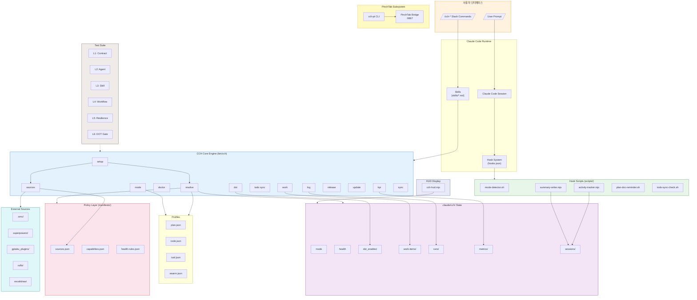
```mermaid
graph TB
    subgraph UserLayer["사용자 인터페이스"]
        USER[/"User Prompt"/]
        SLASH[/"/cch-* Slash Commands"/]
    end

    subgraph ClaudeCode["Claude Code Runtime"]
        CC["Claude Code Session"]
        HOOKS["Hook System<br/>(hooks.json)"]
        SKILLS["Skills<br/>(skills/*.md)"]
    end

    subgraph CoreEngine["CCH Core Engine (bin/cch)"]
        SETUP["setup"]
        MODE["mode"]
        RESOLVE["resolve"]
        DOCTOR["doctor"]
        WORK["work"]
        LOG["log"]
        TODO["todo sync"]
        DOT["dot"]
        KPI["kpi"]
        RELEASE["release"]
        UPDATE["update"]
        SOURCES["sources"]
        SYNC["sync"]
    end

    subgraph HookScripts["Hook Scripts (scripts/)"]
        MD["mode-detector.sh"]
        AT["activity-tracker.mjs"]
        SW["summary-writer.mjs"]
        PDR["plan-doc-reminder.sh"]
        TSC["todo-sync-check.sh"]
    end

    subgraph PolicyLayer["Policy Layer (manifests/)"]
        SRC_JSON["sources.json"]
        CAP_JSON["capabilities.json"]
        HR_JSON["health-rules.json"]
    end

    subgraph ProfileLayer["Profiles"]
        PLAN_P["plan.json"]
        CODE_P["code.json"]
        TOOL_P["tool.json"]
        SWARM_P["swarm.json"]
    end

    subgraph StateLayer[".claude/cch/ State"]
        ST_MODE["mode"]
        ST_HEALTH["health"]
        ST_DOT["dot_enabled"]
        ST_WORK["work-items/"]
        ST_RUNS["runs/"]
        ST_METRICS["metrics/"]
        ST_SESSIONS["sessions/"]
    end

    subgraph ExternalSources["External Sources"]
        OMC[".omc/"]
        SP["superpowers/"]
        GP["gptaku_plugins/"]
        RF["ruflo/"]
        EX["excalidraw/"]
    end

    subgraph PinchTab["PinchTab Subsystem"]
        PT["cch-pt CLI"]
        BRIDGE["PinchTab Bridge<br/>:9867"]
    end

    subgraph HUD["HUD Display"]
        HUD_MJS["cch-hud.mjs"]
    end

    subgraph Tests["Test Suite"]
        T1["L1: Contract"]
        T2["L2: Agent"]
        T3["L3: Skill"]
        T4["L4: Workflow"]
        T5["L5: Resilience"]
        T6["L6: DOT Gate"]
    end

    USER --> CC
    SLASH --> SKILLS
    CC --> HOOKS
    SKILLS --> CoreEngine
    HOOKS --> HookScripts

    SETUP --> SOURCES
    SETUP --> RESOLVE
    SOURCES --> SRC_JSON
    RESOLVE --> PolicyLayer
    RESOLVE --> ProfileLayer
    RESOLVE --> StateLayer
    MODE --> ProfileLayer
    DOT --> ST_DOT
    WORK --> ST_WORK
    LOG --> ST_RUNS
    KPI --> ST_METRICS
    SOURCES --> ExternalSources

    AT --> ST_SESSIONS
    SW --> ST_SESSIONS
    HUD_MJS --> StateLayer

    PT --> BRIDGE

    Tests -.-> CoreEngine

    style UserLayer fill:#FFF3E0,stroke:#F57C00
    style CoreEngine fill:#E3F2FD,stroke:#1565C0
    style HookScripts fill:#E8F5E9,stroke:#2E7D32
    style PolicyLayer fill:#FCE4EC,stroke:#C62828
    style StateLayer fill:#F3E5F5,stroke:#6A1B9A
    style ExternalSources fill:#E0F7FA,stroke:#00838F
    style PinchTab fill:#FFF9C4,stroke:#F9A825
    style HUD fill:#E8EAF6,stroke:#283593
    style Tests fill:#EFEBE9,stroke:#4E342E
```

---

## 2. Plugin Bootstrap & Setup

CCH 플러그인 초기 설치 및 셋업 워크플로우.

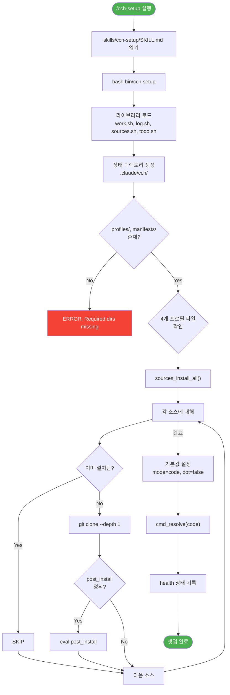
```mermaid
flowchart TD
    START(["/cch-setup 실행"]) --> READ_SKILL["skills/cch-setup/SKILL.md 읽기"]
    READ_SKILL --> RUN_SETUP["bash bin/cch setup"]

    RUN_SETUP --> LOAD_LIBS["라이브러리 로드<br/>work.sh, log.sh, sources.sh, todo.sh"]
    LOAD_LIBS --> CREATE_DIR["상태 디렉토리 생성<br/>.claude/cch/"]
    CREATE_DIR --> CHECK_DIRS{"profiles/, manifests/<br/>존재?"}

    CHECK_DIRS -->|No| ERR_DIR["ERROR: Required dirs missing"]
    CHECK_DIRS -->|Yes| CHECK_PROFILES{"4개 프로필 파일<br/>확인"}

    CHECK_PROFILES --> INSTALL_SOURCES["sources_install_all()"]

    INSTALL_SOURCES --> FOR_EACH["각 소스에 대해"]
    FOR_EACH --> IS_INSTALLED{"이미 설치됨?"}
    IS_INSTALLED -->|Yes| SKIP["SKIP"]
    IS_INSTALLED -->|No| GIT_CLONE["git clone --depth 1"]
    GIT_CLONE --> HAS_POST{"post_install<br/>정의?"}
    HAS_POST -->|Yes| RUN_POST["eval post_install"]
    HAS_POST -->|No| NEXT_SRC["다음 소스"]
    RUN_POST --> NEXT_SRC
    SKIP --> NEXT_SRC
    NEXT_SRC --> FOR_EACH

    FOR_EACH -->|완료| SET_DEFAULTS["기본값 설정<br/>mode=code, dot=false"]
    SET_DEFAULTS --> RESOLVE["cmd_resolve(code)"]
    RESOLVE --> WRITE_HEALTH["health 상태 기록"]
    WRITE_HEALTH --> DONE(["셋업 완료"])

    style START fill:#4CAF50,color:white
    style DONE fill:#4CAF50,color:white
    style ERR_DIR fill:#F44336,color:white
```

---

## 3. Mode Switching Engine

4가지 모드(plan/code/tool/swarm) 전환 및 자동 감지 워크플로우.

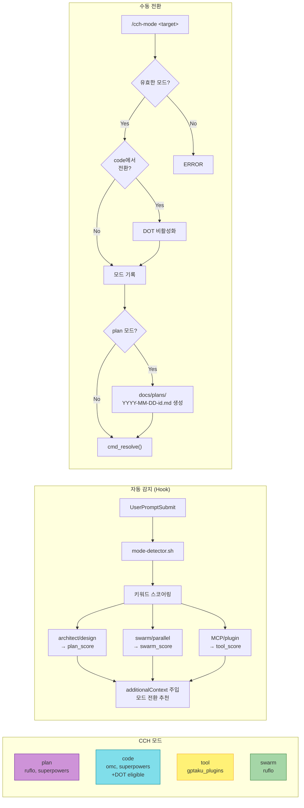
```mermaid
flowchart LR
    subgraph Modes["CCH 모드"]
        PLAN["plan<br/>ruflo, superpowers"]
        CODE["code<br/>omc, superpowers<br/>+DOT eligible"]
        TOOL["tool<br/>gptaku_plugins"]
        SWARM["swarm<br/>ruflo"]
    end

    subgraph AutoDetect["자동 감지 (Hook)"]
        PROMPT["UserPromptSubmit"] --> DETECTOR["mode-detector.sh"]
        DETECTOR --> SCORE["키워드 스코어링"]
        SCORE --> PLAN_KW["architect/design<br/>→ plan_score"]
        SCORE --> SWARM_KW["swarm/parallel<br/>→ swarm_score"]
        SCORE --> TOOL_KW["MCP/plugin<br/>→ tool_score"]
        PLAN_KW --> INJECT["additionalContext 주입<br/>모드 전환 추천"]
        SWARM_KW --> INJECT
        TOOL_KW --> INJECT
    end

    subgraph ManualSwitch["수동 전환"]
        CMD["/cch-mode &lt;target&gt;"] --> VALIDATE{"유효한 모드?"}
        VALIDATE -->|Yes| CHECK_DOT{"code에서<br/>전환?"}
        CHECK_DOT -->|Yes| DISABLE_DOT["DOT 비활성화"]
        CHECK_DOT -->|No| WRITE_MODE["모드 기록"]
        DISABLE_DOT --> WRITE_MODE
        VALIDATE -->|No| ERR["ERROR"]
        WRITE_MODE --> TO_PLAN{"plan 모드?"}
        TO_PLAN -->|Yes| CREATE_PLAN["docs/plans/<br/>YYYY-MM-DD-id.md 생성"]
        TO_PLAN -->|No| RE_RESOLVE["cmd_resolve()"]
        CREATE_PLAN --> RE_RESOLVE
    end

    style PLAN fill:#CE93D8,stroke:#6A1B9A
    style CODE fill:#80DEEA,stroke:#00838F
    style TOOL fill:#FFF176,stroke:#F9A825
    style SWARM fill:#A5D6A7,stroke:#2E7D32
```

---

## 4. Capability Resolution & Health Evaluation

소스 가용성 기반 건강 상태 평가 시스템.

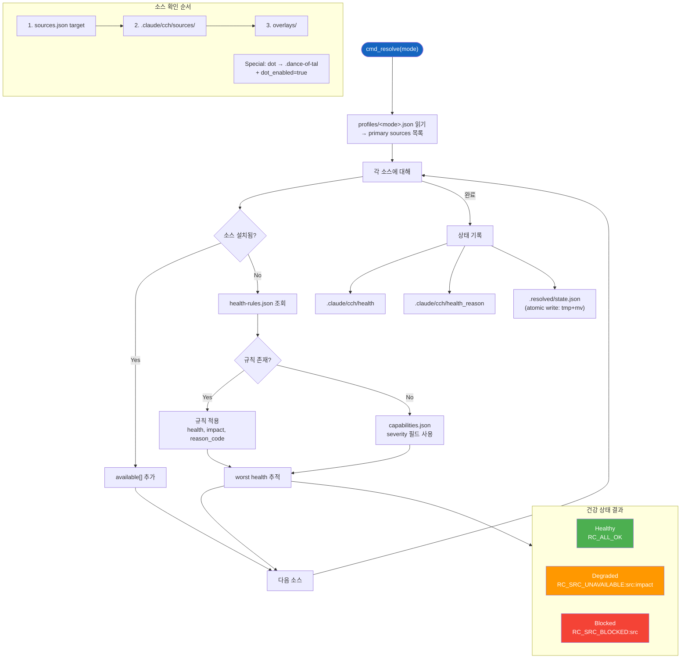
```mermaid
flowchart TD
    START(["cmd_resolve(mode)"]) --> READ_PROFILE["profiles/&lt;mode&gt;.json 읽기<br/>→ primary sources 목록"]

    READ_PROFILE --> FOR_SRC["각 소스에 대해"]
    FOR_SRC --> CHECK_AVAIL{"소스 설치됨?"}

    CHECK_AVAIL -->|Yes| ADD_AVAIL["available[] 추가"]
    CHECK_AVAIL -->|No| LOOKUP_RULE["health-rules.json 조회"]

    LOOKUP_RULE --> RULE_FOUND{"규칙 존재?"}
    RULE_FOUND -->|Yes| APPLY_RULE["규칙 적용<br/>health, impact, reason_code"]
    RULE_FOUND -->|No| FALLBACK_CAP["capabilities.json<br/>severity 필드 사용"]

    APPLY_RULE --> TRACK_WORST["worst health 추적"]
    FALLBACK_CAP --> TRACK_WORST
    ADD_AVAIL --> NEXT["다음 소스"]
    TRACK_WORST --> NEXT
    NEXT --> FOR_SRC

    FOR_SRC -->|완료| WRITE_STATE["상태 기록"]
    WRITE_STATE --> HEALTH_FILE[".claude/cch/health"]
    WRITE_STATE --> REASON_FILE[".claude/cch/health_reason"]
    WRITE_STATE --> RESOLVED_JSON[".resolved/state.json<br/>(atomic write: tmp+mv)"]

    subgraph HealthOutcomes["건강 상태 결과"]
        HEALTHY["Healthy<br/>RC_ALL_OK"]
        DEGRADED["Degraded<br/>RC_SRC_UNAVAILABLE:src:impact"]
        BLOCKED["Blocked<br/>RC_SRC_BLOCKED:src"]
    end

    TRACK_WORST --> HealthOutcomes

    subgraph CheckOrder["소스 확인 순서"]
        direction LR
        C1["1. sources.json target"] --> C2["2. .claude/cch/sources/"]
        C2 --> C3["3. overlays/"]
        C4["Special: dot → .dance-of-tal<br/>+ dot_enabled=true"]
    end

    style START fill:#1565C0,color:white
    style HEALTHY fill:#4CAF50,color:white
    style DEGRADED fill:#FF9800,color:white
    style BLOCKED fill:#F44336,color:white
```

---

## 5. Hook Event Pipeline

Claude Code 라이프사이클 이벤트에 연결된 후크 실행 파이프라인.

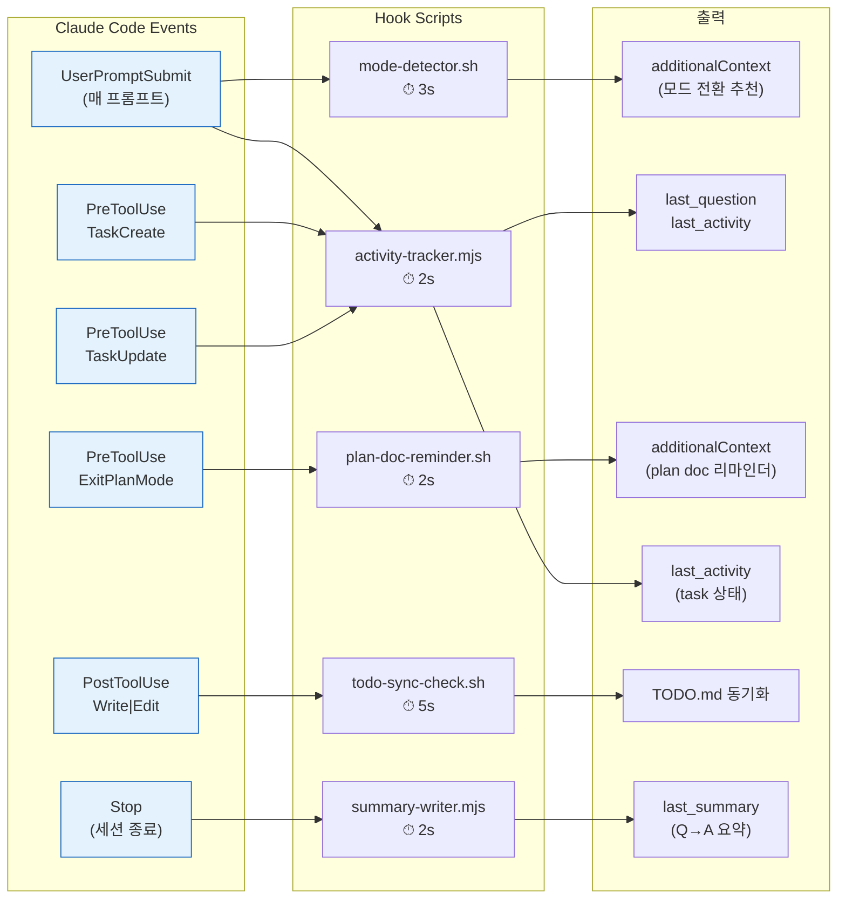
```mermaid
flowchart LR
    subgraph Events["Claude Code Events"]
        E1["UserPromptSubmit<br/>(매 프롬프트)"]
        E2["PreToolUse<br/>ExitPlanMode"]
        E3["PreToolUse<br/>TaskCreate"]
        E4["PreToolUse<br/>TaskUpdate"]
        E5["PostToolUse<br/>Write|Edit"]
        E6["Stop<br/>(세션 종료)"]
    end

    subgraph Scripts["Hook Scripts"]
        S1["mode-detector.sh<br/>⏱ 3s"]
        S2["activity-tracker.mjs<br/>⏱ 2s"]
        S3["plan-doc-reminder.sh<br/>⏱ 2s"]
        S4["todo-sync-check.sh<br/>⏱ 5s"]
        S5["summary-writer.mjs<br/>⏱ 2s"]
    end

    subgraph Outputs["출력"]
        O1["additionalContext<br/>(모드 전환 추천)"]
        O2["last_question<br/>last_activity"]
        O3["additionalContext<br/>(plan doc 리마인더)"]
        O4["last_activity<br/>(task 상태)"]
        O5["TODO.md 동기화"]
        O6["last_summary<br/>(Q→A 요약)"]
    end

    E1 --> S1 --> O1
    E1 --> S2 --> O2
    E2 --> S3 --> O3
    E3 --> S2
    E4 --> S2 --> O4
    E5 --> S4 --> O5
    E6 --> S5 --> O6

    style E1 fill:#E3F2FD,stroke:#1565C0
    style E2 fill:#E3F2FD,stroke:#1565C0
    style E3 fill:#E3F2FD,stroke:#1565C0
    style E4 fill:#E3F2FD,stroke:#1565C0
    style E5 fill:#E3F2FD,stroke:#1565C0
    style E6 fill:#E3F2FD,stroke:#1565C0
```

---

## 6. Activity Tracker State Machine

활동 추적기의 이벤트별 상태 전이.

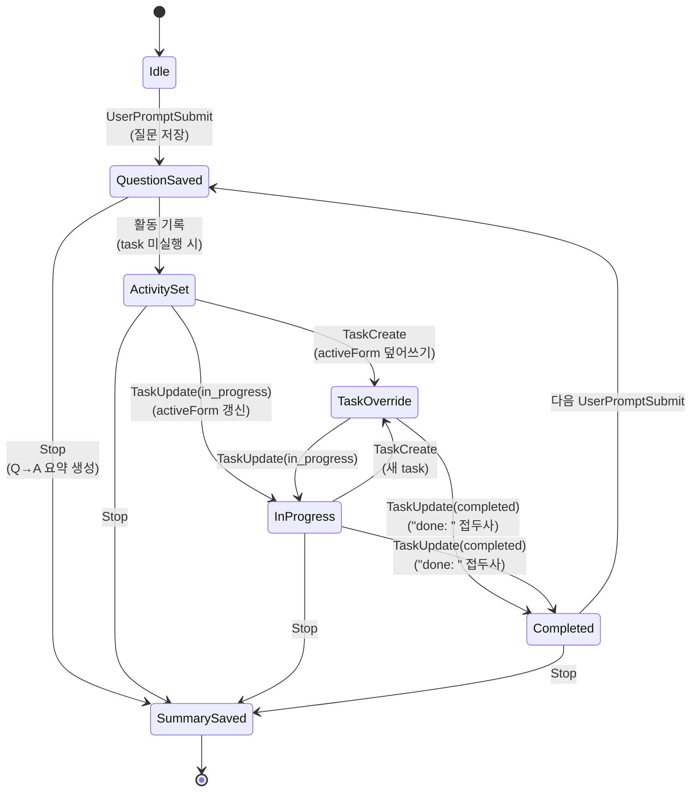
```mermaid
stateDiagram-v2
    [*] --> Idle

    Idle --> QuestionSaved : UserPromptSubmit<br/>(질문 저장)
    QuestionSaved --> ActivitySet : 활동 기록<br/>(task 미실행 시)

    ActivitySet --> TaskOverride : TaskCreate<br/>(activeForm 덮어쓰기)
    ActivitySet --> InProgress : TaskUpdate(in_progress)<br/>(activeForm 갱신)

    TaskOverride --> InProgress : TaskUpdate(in_progress)
    TaskOverride --> Completed : TaskUpdate(completed)<br/>("done: " 접두사)

    InProgress --> Completed : TaskUpdate(completed)<br/>("done: " 접두사)
    InProgress --> TaskOverride : TaskCreate<br/>(새 task)

    Completed --> QuestionSaved : 다음 UserPromptSubmit

    QuestionSaved --> SummarySaved : Stop<br/>(Q→A 요약 생성)
    ActivitySet --> SummarySaved : Stop
    InProgress --> SummarySaved : Stop
    Completed --> SummarySaved : Stop

    SummarySaved --> [*]
```

---

## 7. Work Item Lifecycle

작업 항목의 상태 전이 및 관리 워크플로우.

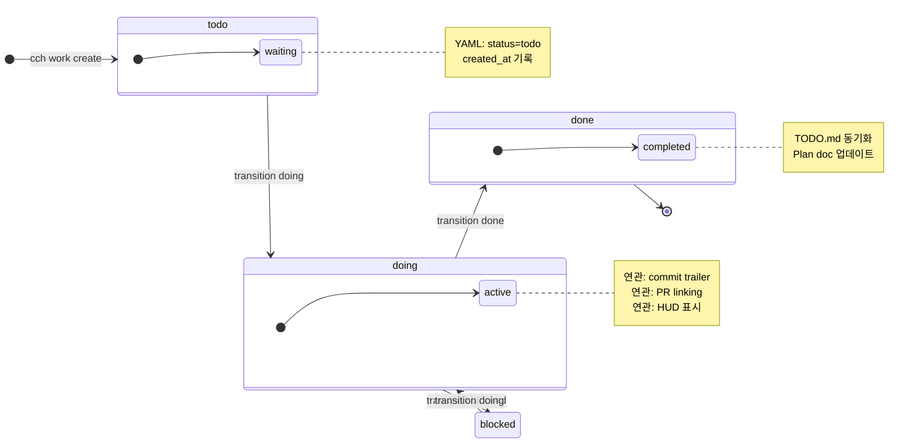
```mermaid
stateDiagram-v2
    direction LR

    [*] --> todo : cch work create

    todo --> doing : transition doing
    doing --> blocked : transition blocked
    blocked --> doing : transition doing
    doing --> done : transition done

    done --> [*]

    state todo {
        [*] --> waiting
        note right of waiting
            YAML: status=todo
            created_at 기록
        end note
    }

    state doing {
        [*] --> active
        note right of active
            연관: commit trailer
            연관: PR linking
            연관: HUD 표시
        end note
    }

    state done {
        [*] --> completed
        note right of completed
            TODO.md 동기화
            Plan doc 업데이트
        end note
    }
```

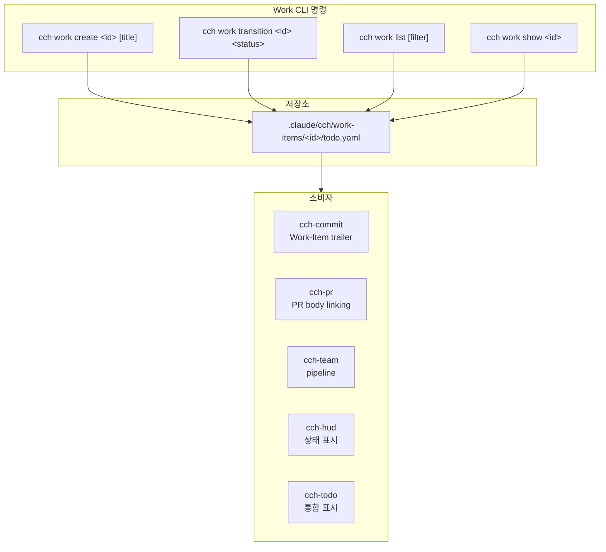
```mermaid
flowchart TD
    subgraph Commands["Work CLI 명령"]
        CREATE["cch work create &lt;id&gt; [title]"]
        TRANS["cch work transition &lt;id&gt; &lt;status&gt;"]
        LIST["cch work list [filter]"]
        SHOW["cch work show &lt;id&gt;"]
    end

    subgraph Storage["저장소"]
        YAML[".claude/cch/work-items/&lt;id&gt;/todo.yaml"]
    end

    subgraph Consumers["소비자"]
        COMMIT["cch-commit<br/>Work-Item trailer"]
        PR["cch-pr<br/>PR body linking"]
        TEAM["cch-team<br/>pipeline"]
        HUD_W["cch-hud<br/>상태 표시"]
        TODO_W["cch-todo<br/>통합 표시"]
    end

    CREATE --> YAML
    TRANS --> YAML
    LIST --> YAML
    SHOW --> YAML
    YAML --> Consumers
```

---

## 8. TODO Synchronization Engine

TODO.md SSOT(Single Source of Truth) 동기화 시스템.

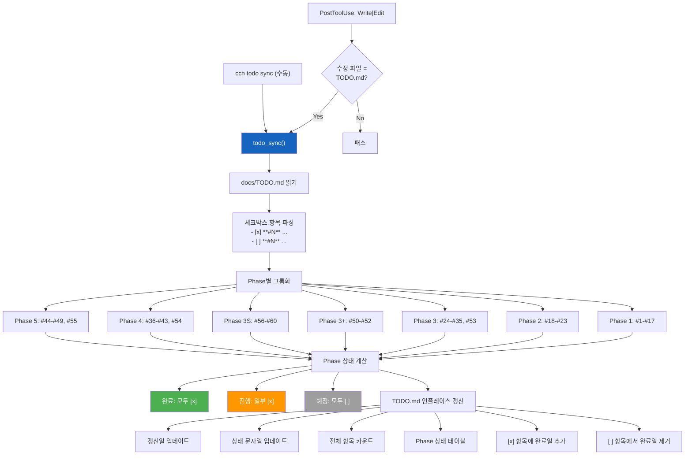
```mermaid
flowchart TD
    TRIGGER1["PostToolUse: Write|Edit"] --> CHECK{"수정 파일 =<br/>TODO.md?"}
    CHECK -->|Yes| SYNC["todo_sync()"]
    CHECK -->|No| SKIP["패스"]
    TRIGGER2["cch todo sync (수동)"] --> SYNC

    SYNC --> READ["docs/TODO.md 읽기"]
    READ --> PARSE["체크박스 항목 파싱<br/>- [x] **#N** ...<br/>- [ ] **#N** ..."]

    PARSE --> GROUP["Phase별 그룹화"]
    GROUP --> P1["Phase 1: #1-#17"]
    GROUP --> P2["Phase 2: #18-#23"]
    GROUP --> P3["Phase 3: #24-#35, #53"]
    GROUP --> P3P["Phase 3+: #50-#52"]
    GROUP --> P3S["Phase 3S: #56-#60"]
    GROUP --> P4["Phase 4: #36-#43, #54"]
    GROUP --> P5["Phase 5: #44-#49, #55"]

    P1 & P2 & P3 & P3P & P3S & P4 & P5 --> CALC["Phase 상태 계산"]
    CALC --> STATUS_DONE["완료: 모두 [x]"]
    CALC --> STATUS_PROG["진행: 일부 [x]"]
    CALC --> STATUS_PEND["예정: 모두 [ ]"]

    CALC --> UPDATE["TODO.md 인플레이스 갱신"]
    UPDATE --> U1["갱신일 업데이트"]
    UPDATE --> U2["상태 문자열 업데이트"]
    UPDATE --> U3["전체 항목 카운트"]
    UPDATE --> U4["Phase 상태 테이블"]
    UPDATE --> U5["[x] 항목에 완료일 추가"]
    UPDATE --> U6["[ ] 항목에서 완료일 제거"]

    style SYNC fill:#1565C0,color:white
    style STATUS_DONE fill:#4CAF50,color:white
    style STATUS_PROG fill:#FF9800,color:white
    style STATUS_PEND fill:#9E9E9E,color:white
```

---

## 9. Source Management System

Git 기반 외부 의존성 관리 시스템.

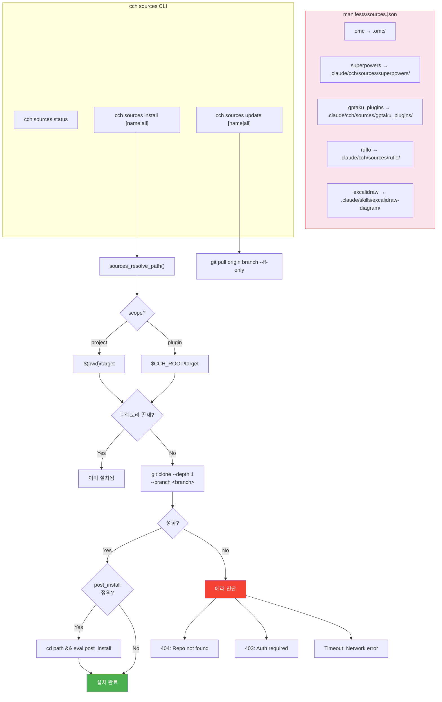
```mermaid
flowchart TD
    subgraph Registry["manifests/sources.json"]
        OMC_R["omc → .omc/"]
        SP_R["superpowers → .claude/cch/sources/superpowers/"]
        GP_R["gptaku_plugins → .claude/cch/sources/gptaku_plugins/"]
        RF_R["ruflo → .claude/cch/sources/ruflo/"]
        EX_R["excalidraw → .claude/skills/excalidraw-diagram/"]
    end

    subgraph CLI["cch sources CLI"]
        STATUS_CMD["cch sources status"]
        INSTALL_CMD["cch sources install [name|all]"]
        UPDATE_CMD["cch sources update [name|all]"]
    end

    INSTALL_CMD --> RESOLVE_PATH["sources_resolve_path()"]
    RESOLVE_PATH --> SCOPE{"scope?"}
    SCOPE -->|project| PWD_PATH["$(pwd)/target"]
    SCOPE -->|plugin| CCH_PATH["$CCH_ROOT/target"]

    PWD_PATH & CCH_PATH --> EXISTS{"디렉토리 존재?"}
    EXISTS -->|Yes| SKIP_I["이미 설치됨"]
    EXISTS -->|No| CLONE["git clone --depth 1<br/>--branch &lt;branch&gt;"]

    CLONE --> SUCCESS{"성공?"}
    SUCCESS -->|Yes| POST{"post_install<br/>정의?"}
    POST -->|Yes| RUN_POST["cd path && eval post_install"]
    POST -->|No| DONE_I["설치 완료"]
    RUN_POST --> DONE_I
    SUCCESS -->|No| DIAGNOSE["에러 진단"]
    DIAGNOSE --> D404["404: Repo not found"]
    DIAGNOSE --> DAUTH["403: Auth required"]
    DIAGNOSE --> DNET["Timeout: Network error"]

    UPDATE_CMD --> PULL["git pull origin branch --ff-only"]

    style Registry fill:#FCE4EC,stroke:#C62828
    style DONE_I fill:#4CAF50,color:white
    style DIAGNOSE fill:#F44336,color:white
```

---

## 10. DOT Experiment System

DOT(Dance of Tal) 실험 게이트 및 KPI 시스템.

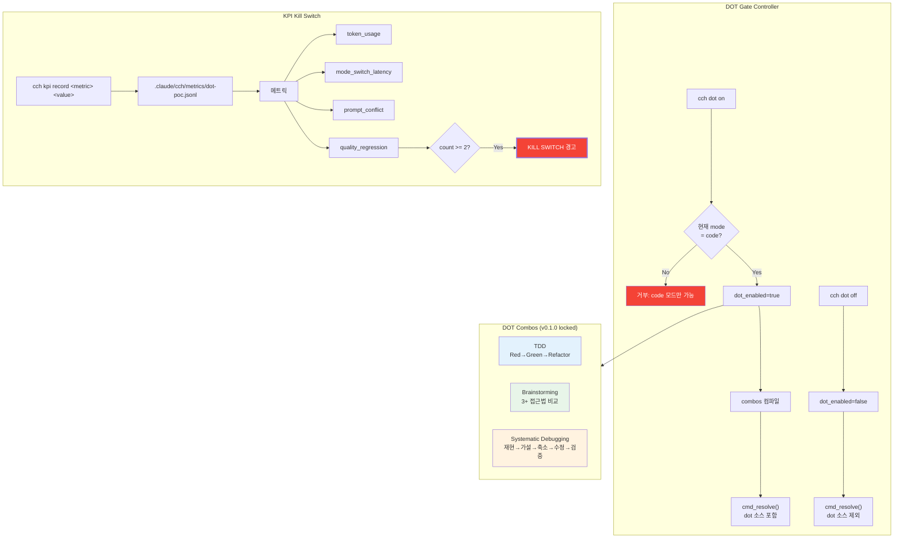
```mermaid
flowchart TD
    subgraph DOTGate["DOT Gate Controller"]
        DOT_ON["cch dot on"] --> CHECK_MODE{"현재 mode<br/>= code?"}
        CHECK_MODE -->|No| REJECT["거부: code 모드만 가능"]
        CHECK_MODE -->|Yes| ENABLE["dot_enabled=true"]
        ENABLE --> COMPILE["combos 컴파일"]
        COMPILE --> RE_RESOLVE["cmd_resolve()<br/>dot 소스 포함"]

        DOT_OFF["cch dot off"] --> DISABLE["dot_enabled=false"]
        DISABLE --> RE_RESOLVE2["cmd_resolve()<br/>dot 소스 제외"]
    end

    subgraph Combos["DOT Combos (v0.1.0 locked)"]
        TDD["TDD<br/>Red→Green→Refactor"]
        BRAIN["Brainstorming<br/>3+ 접근법 비교"]
        DEBUG["Systematic Debugging<br/>재현→가설→축소→수정→검증"]
    end

    subgraph KPI["KPI Kill Switch"]
        RECORD["cch kpi record &lt;metric&gt; &lt;value&gt;"]
        RECORD --> JSONL[".claude/cch/metrics/dot-poc.jsonl"]
        JSONL --> METRICS["메트릭"]
        METRICS --> M1["token_usage"]
        METRICS --> M2["mode_switch_latency"]
        METRICS --> M3["prompt_conflict"]
        METRICS --> M4["quality_regression"]
        M4 --> KILL{"count >= 2?"}
        KILL -->|Yes| KILLSWITCH["KILL SWITCH 경고"]
    end

    ENABLE --> Combos

    style REJECT fill:#F44336,color:white
    style KILLSWITCH fill:#F44336,color:white,stroke-width:3px
    style TDD fill:#E3F2FD
    style BRAIN fill:#E8F5E9
    style DEBUG fill:#FFF3E0
```

---

## 11. Team Pipeline (Dev → Test → Verify)

멀티 에이전트 순차 실행 파이프라인.

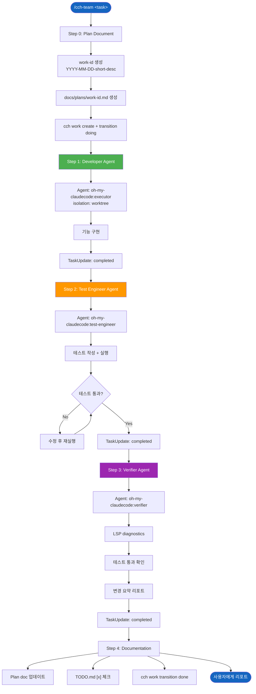
```mermaid
flowchart TD
    START(["/cch-team &lt;task&gt;"]) --> PLAN_DOC["Step 0: Plan Document"]

    PLAN_DOC --> GEN_ID["work-id 생성<br/>YYYY-MM-DD-short-desc"]
    GEN_ID --> CREATE_PLAN["docs/plans/work-id.md 생성"]
    CREATE_PLAN --> REGISTER["cch work create + transition doing"]

    REGISTER --> DEV["Step 1: Developer Agent"]
    DEV --> DEV_AGENT["Agent: oh-my-claudecode:executor<br/>isolation: worktree"]
    DEV_AGENT --> DEV_IMPL["기능 구현"]
    DEV_IMPL --> DEV_DONE["TaskUpdate: completed"]

    DEV_DONE --> TEST["Step 2: Test Engineer Agent"]
    TEST --> TEST_AGENT["Agent: oh-my-claudecode:test-engineer"]
    TEST_AGENT --> WRITE_TEST["테스트 작성 + 실행"]
    WRITE_TEST --> FIX_LOOP{"테스트 통과?"}
    FIX_LOOP -->|No| FIX["수정 후 재실행"]
    FIX --> FIX_LOOP
    FIX_LOOP -->|Yes| TEST_DONE["TaskUpdate: completed"]

    TEST_DONE --> VERIFY["Step 3: Verifier Agent"]
    VERIFY --> VERIFY_AGENT["Agent: oh-my-claudecode:verifier"]
    VERIFY_AGENT --> LSP["LSP diagnostics"]
    LSP --> TEST_CONFIRM["테스트 통과 확인"]
    TEST_CONFIRM --> CHANGE_SUMMARY["변경 요약 리포트"]
    CHANGE_SUMMARY --> VERIFY_DONE["TaskUpdate: completed"]

    VERIFY_DONE --> FINALIZE["Step 4: Documentation"]
    FINALIZE --> UPDATE_PLAN["Plan doc 업데이트"]
    FINALIZE --> UPDATE_TODO["TODO.md [x] 체크"]
    FINALIZE --> WORK_DONE["cch work transition done"]
    FINALIZE --> REPORT(["사용자에게 리포트"])

    style START fill:#1565C0,color:white
    style DEV fill:#4CAF50,color:white
    style TEST fill:#FF9800,color:white
    style VERIFY fill:#9C27B0,color:white
    style REPORT fill:#1565C0,color:white
```

---

## 12. Commit Workflow

논리적 분할 커밋 워크플로우.

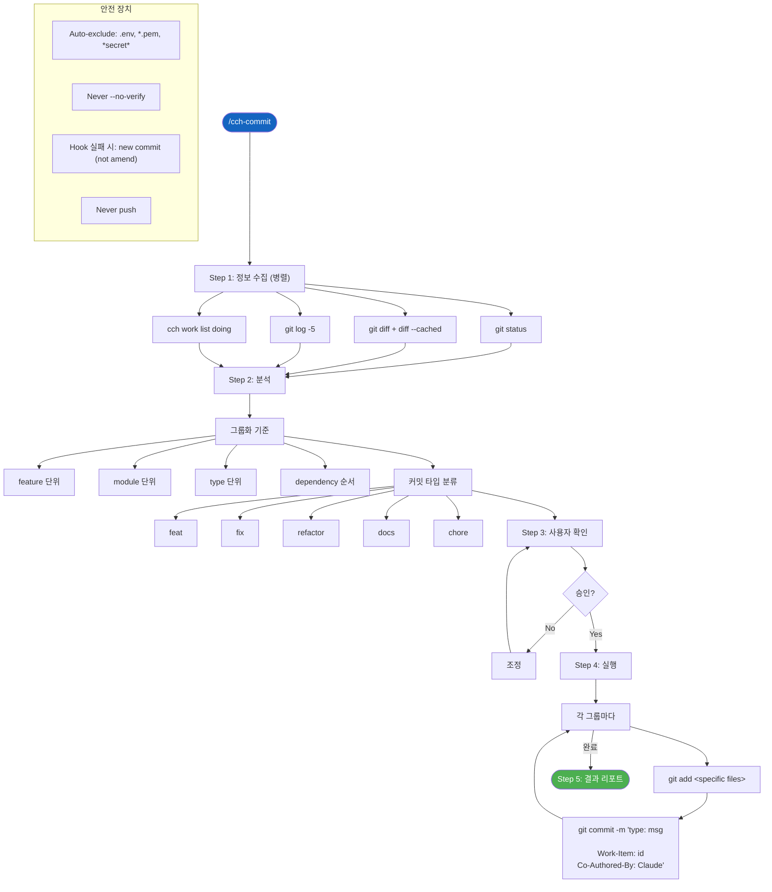
```mermaid
flowchart TD
    START(["/cch-commit"]) --> COLLECT["Step 1: 정보 수집 (병렬)"]

    COLLECT --> GS["git status"]
    COLLECT --> GD["git diff + diff --cached"]
    COLLECT --> GL["git log -5"]
    COLLECT --> WL["cch work list doing"]

    GS & GD & GL & WL --> ANALYZE["Step 2: 분석"]
    ANALYZE --> GROUP["그룹화 기준"]
    GROUP --> G1["feature 단위"]
    GROUP --> G2["module 단위"]
    GROUP --> G3["type 단위"]
    GROUP --> G4["dependency 순서"]

    GROUP --> TYPES["커밋 타입 분류"]
    TYPES --> T_FEAT["feat"]
    TYPES --> T_FIX["fix"]
    TYPES --> T_REF["refactor"]
    TYPES --> T_DOC["docs"]
    TYPES --> T_CHR["chore"]

    TYPES --> CONFIRM["Step 3: 사용자 확인"]
    CONFIRM --> APPROVE{"승인?"}
    APPROVE -->|No| ADJUST["조정"]
    ADJUST --> CONFIRM
    APPROVE -->|Yes| EXECUTE["Step 4: 실행"]

    EXECUTE --> FOR_GROUP["각 그룹마다"]
    FOR_GROUP --> ADD["git add &lt;specific files&gt;"]
    ADD --> COMMIT["git commit -m 'type: msg<br/><br/>Work-Item: id<br/>Co-Authored-By: Claude'"]
    COMMIT --> FOR_GROUP

    FOR_GROUP -->|완료| REPORT(["Step 5: 결과 리포트"])

    subgraph Safety["안전 장치"]
        S1["Auto-exclude: .env, *.pem, *secret*"]
        S2["Never --no-verify"]
        S3["Hook 실패 시: new commit (not amend)"]
        S4["Never push"]
    end

    style START fill:#1565C0,color:white
    style REPORT fill:#4CAF50,color:white
```

---

## 13. Pull Request Workflow

Work-Item 연결 PR 생성 워크플로우.

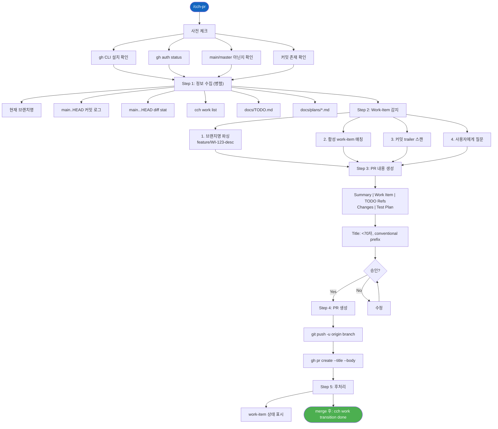
```mermaid
flowchart TD
    START(["/cch-pr"]) --> PRECHECK["사전 체크"]
    PRECHECK --> P1["gh CLI 설치 확인"]
    PRECHECK --> P2["gh auth status"]
    PRECHECK --> P3["main/master 아닌지 확인"]
    PRECHECK --> P4["커밋 존재 확인"]

    P1 & P2 & P3 & P4 --> COLLECT["Step 1: 정보 수집 (병렬)"]
    COLLECT --> BRANCH["현재 브랜치명"]
    COLLECT --> COMMITS["main..HEAD 커밋 로그"]
    COLLECT --> DIFF_STAT["main...HEAD diff stat"]
    COLLECT --> WORK_ITEMS["cch work list"]
    COLLECT --> TODO_READ["docs/TODO.md"]
    COLLECT --> PLANS["docs/plans/*.md"]

    COLLECT --> DETECT_WI["Step 2: Work-Item 감지"]
    DETECT_WI --> D1["1. 브랜치명 파싱<br/>feature/WI-123-desc"]
    DETECT_WI --> D2["2. 활성 work-item 매칭"]
    DETECT_WI --> D3["3. 커밋 trailer 스캔"]
    DETECT_WI --> D4["4. 사용자에게 질문"]

    D1 & D2 & D3 & D4 --> GENERATE["Step 3: PR 내용 생성"]
    GENERATE --> SECTIONS["Summary | Work Item | TODO Refs<br/>Changes | Test Plan"]
    SECTIONS --> TITLE["Title: <70자, conventional prefix"]

    TITLE --> APPROVE{"승인?"}
    APPROVE -->|Yes| CREATE_PR["Step 4: PR 생성"]
    APPROVE -->|No| REVISE["수정"]
    REVISE --> APPROVE

    CREATE_PR --> PUSH["git push -u origin branch"]
    PUSH --> GH_PR["gh pr create --title --body"]

    GH_PR --> POST["Step 5: 후처리"]
    POST --> SHOW_WI["work-item 상태 표시"]
    POST --> GUIDE(["merge 후: cch work transition done"])

    style START fill:#1565C0,color:white
    style GUIDE fill:#4CAF50,color:white
```

---

## 14. Release Build System

릴리스 번들 빌드 및 무결성 검증 시스템.

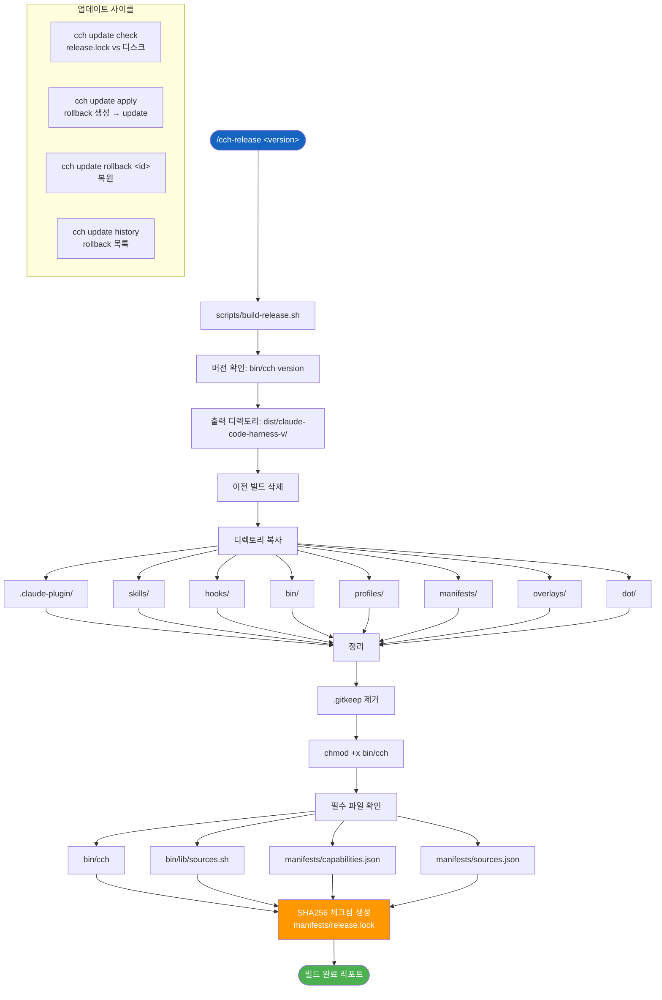
```mermaid
flowchart TD
    START(["/cch-release &lt;version&gt;"]) --> BUILD["scripts/build-release.sh"]

    BUILD --> GET_VER["버전 확인: bin/cch version"]
    GET_VER --> SET_OUT["출력 디렉토리: dist/claude-code-harness-v/"]
    SET_OUT --> CLEAN["이전 빌드 삭제"]

    CLEAN --> COPY["디렉토리 복사"]
    COPY --> C1[".claude-plugin/"]
    COPY --> C2["skills/"]
    COPY --> C3["hooks/"]
    COPY --> C4["bin/"]
    COPY --> C5["profiles/"]
    COPY --> C6["manifests/"]
    COPY --> C7["overlays/"]
    COPY --> C8["dot/"]

    C1 & C2 & C3 & C4 & C5 & C6 & C7 & C8 --> CLEANUP["정리"]
    CLEANUP --> RM_GITKEEP[".gitkeep 제거"]
    RM_GITKEEP --> CHMOD["chmod +x bin/cch"]

    CHMOD --> VERIFY["필수 파일 확인"]
    VERIFY --> V1["bin/cch"]
    VERIFY --> V2["bin/lib/sources.sh"]
    VERIFY --> V3["manifests/capabilities.json"]
    VERIFY --> V4["manifests/sources.json"]

    V1 & V2 & V3 & V4 --> LOCK["SHA256 체크섬 생성<br/>manifests/release.lock"]

    LOCK --> REPORT(["빌드 완료 리포트"])

    subgraph UpdateCycle["업데이트 사이클"]
        CHECK["cch update check<br/>release.lock vs 디스크"]
        APPLY["cch update apply<br/>rollback 생성 → update"]
        ROLLBACK["cch update rollback &lt;id&gt;<br/>복원"]
        HISTORY["cch update history<br/>rollback 목록"]
    end

    style START fill:#1565C0,color:white
    style REPORT fill:#4CAF50,color:white
    style LOCK fill:#FF9800,color:white
```

---

## 15. PinchTab Web UI Automation

웹 UI 자동화 서브시스템.

```mermaid
flowchart TD
    subgraph TestMode["테스트 모드"]
        TM_START(["/cch-pinchtab &lt;url&gt; &lt;test&gt;"]) --> TM_INIT["Session Init"]
        TM_INIT --> TM_INFRA["pt-infra Agent<br/>PinchTab 시작 + 탭 생성"]
        TM_INFRA --> TM_TEST["pt-test Agent<br/>YAML 시나리오 OR LLM 단계 실행"]
        TM_TEST --> TM_REPORT["pt-report Agent<br/>CLI 요약 + Markdown 리포트"]
    end

    subgraph WorkflowMode["워크플로우 모드"]
        WM_START(["/cch-pinchtab &lt;url&gt; &lt;goal&gt;"]) --> WM_PLAN["W1: PLAN<br/>자연어 → 단계 변환"]
        WM_PLAN --> WM_APPROVE{"사용자 승인?"}
        WM_APPROVE -->|Yes| WM_INFRA["W2: pt-infra"]
        WM_APPROVE -->|No| WM_PLAN
        WM_INFRA --> WM_EXEC["W3: EXECUTE<br/>deep-executor Agent"]
        WM_EXEC --> WM_LOOP["OBSERVE-THINK-ACT-VERIFY-RECORD"]
        WM_LOOP --> WM_DONE{"완료?"}
        WM_DONE -->|No| WM_LOOP
        WM_DONE -->|Yes| WM_REPORT["W4: REPORT<br/>scientist Agent"]
    end

    subgraph ExecLoop["실행 루프 상세"]
        OBSERVE["OBSERVE: snap interactive"]
        THINK["THINK: Adaptive Ref Resolution"]
        ACT["ACT: fill/click/press/nav"]
        VERIFY_E["VERIFY: snap diff + text"]
        RECORD["RECORD: JSON 결과 축적"]
    end

    subgraph Termination["종료 조건"]
        T1["모든 단계 완료"]
        T2["사용자 중단"]
        T3["30 max steps"]
        T4["300s timeout"]
        T5["3 연속 실패"]
    end

    subgraph Exceptions["예외 처리"]
        EX1["ref not found → 재스냅샷 + 분석"]
        EX2["unexpected popup → 스크린샷 + 질문"]
        EX3["login required → headed 모드 제안"]
        EX4["captcha → headed 모드 or 중단"]
        EX5["timeout → 2s 대기 + 1 재시도"]
    end

    subgraph PTCLI["cch-pt CLI Commands"]
        PT_ENSURE["ensure [headless]"]
        PT_HEALTH["health"]
        PT_NAV["nav &lt;url&gt;"]
        PT_SNAP["snap [filter]"]
        PT_CLICK["click &lt;ref&gt;"]
        PT_FILL["fill &lt;ref&gt; &lt;text&gt;"]
        PT_SCREENSHOT["screenshot [path]"]
        PT_EVAL["eval &lt;expr&gt;"]
    end

    style TestMode fill:#E3F2FD,stroke:#1565C0
    style WorkflowMode fill:#E8F5E9,stroke:#2E7D32
    style Exceptions fill:#FFF3E0,stroke:#F57C00
```

---

## 16. HUD Status Bar System

상태바 표시 시스템 아키텍처.

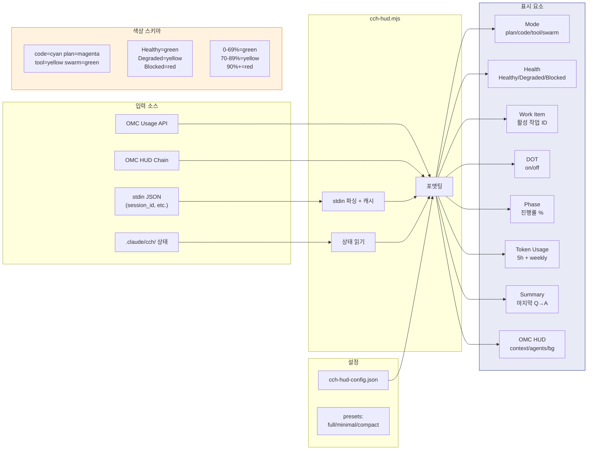
```mermaid
flowchart LR
    subgraph Input["입력 소스"]
        STDIN["stdin JSON<br/>(session_id, etc.)"]
        STATE[".claude/cch/ 상태"]
        OMC_API["OMC Usage API"]
        OMC_HUD["OMC HUD Chain"]
    end

    subgraph HUDEngine["cch-hud.mjs"]
        PARSE["stdin 파싱 + 캐시"]
        READ_STATE["상태 읽기"]
        FORMAT["포맷팅"]
    end

    subgraph Elements["표시 요소"]
        E_MODE["Mode<br/>plan/code/tool/swarm"]
        E_HEALTH["Health<br/>Healthy/Degraded/Blocked"]
        E_WORK["Work Item<br/>활성 작업 ID"]
        E_DOT["DOT<br/>on/off"]
        E_PHASE["Phase<br/>진행률 %"]
        E_TOKEN["Token Usage<br/>5h + weekly"]
        E_SUMMARY["Summary<br/>마지막 Q→A"]
        E_OMC["OMC HUD<br/>context/agents/bg"]
    end

    subgraph Config["설정"]
        CFG["cch-hud-config.json"]
        PRESETS["presets:<br/>full/minimal/compact"]
    end

    STDIN --> PARSE
    STATE --> READ_STATE
    OMC_API --> FORMAT
    OMC_HUD --> FORMAT

    PARSE --> FORMAT
    READ_STATE --> FORMAT
    CFG --> FORMAT

    FORMAT --> E_MODE
    FORMAT --> E_HEALTH
    FORMAT --> E_WORK
    FORMAT --> E_DOT
    FORMAT --> E_PHASE
    FORMAT --> E_TOKEN
    FORMAT --> E_SUMMARY
    FORMAT --> E_OMC

    subgraph ColorScheme["색상 스키마"]
        CS_MODE["code=cyan plan=magenta<br/>tool=yellow swarm=green"]
        CS_HEALTH["Healthy=green<br/>Degraded=yellow<br/>Blocked=red"]
        CS_TOKEN["0-69%=green<br/>70-89%=yellow<br/>90%+=red"]
    end

    style Elements fill:#E8EAF6,stroke:#283593
    style ColorScheme fill:#FFF3E0,stroke:#F57C00
```

---

## 17. Execution Logging System

실행 로그 및 증거 기록 시스템.

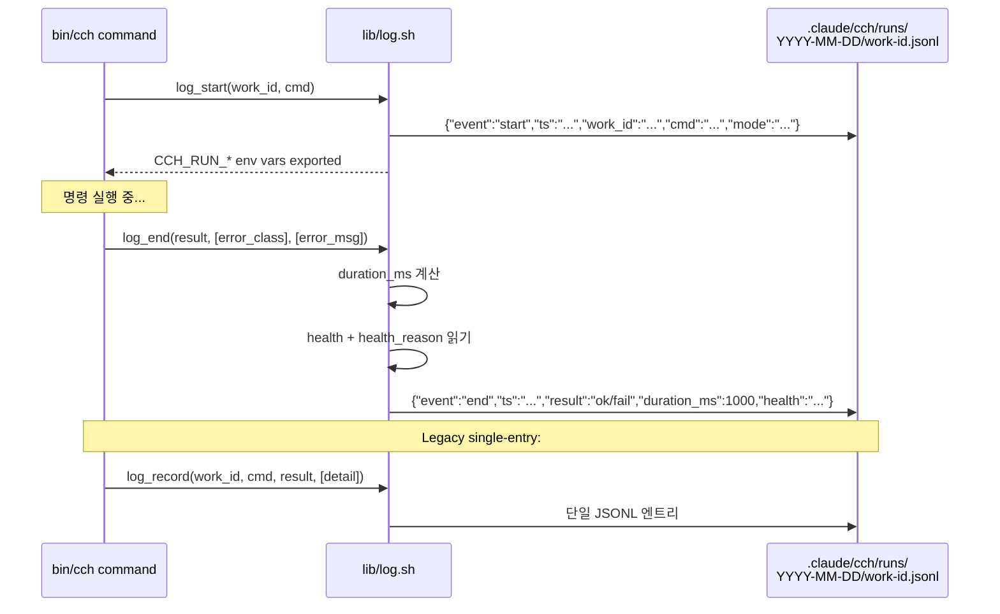
```mermaid
sequenceDiagram
    participant CMD as bin/cch command
    participant LOG as lib/log.sh
    participant FILE as .claude/cch/runs/<br/>YYYY-MM-DD/work-id.jsonl

    CMD->>LOG: log_start(work_id, cmd)
    LOG->>FILE: {"event":"start","ts":"...","work_id":"...","cmd":"...","mode":"..."}
    LOG-->>CMD: CCH_RUN_* env vars exported

    Note over CMD: 명령 실행 중...

    CMD->>LOG: log_end(result, [error_class], [error_msg])
    LOG->>LOG: duration_ms 계산
    LOG->>LOG: health + health_reason 읽기
    LOG->>FILE: {"event":"end","ts":"...","result":"ok/fail","duration_ms":1000,"health":"..."}

    Note over CMD,FILE: Legacy single-entry:
    CMD->>LOG: log_record(work_id, cmd, result, [detail])
    LOG->>FILE: 단일 JSONL 엔트리
```

---

## 18. Test Architecture (6-Layer)

6계층 테스트 아키텍처.

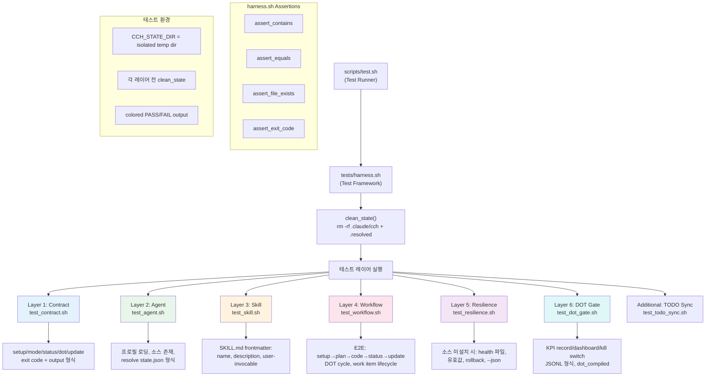
```mermaid
flowchart TD
    RUNNER["scripts/test.sh<br/>(Test Runner)"] --> HARNESS["tests/harness.sh<br/>(Test Framework)"]

    HARNESS --> CLEAN["clean_state()<br/>rm -rf .claude/cch + .resolved"]
    CLEAN --> LAYERS["테스트 레이어 실행"]

    LAYERS --> L1["Layer 1: Contract<br/>test_contract.sh"]
    LAYERS --> L2["Layer 2: Agent<br/>test_agent.sh"]
    LAYERS --> L3["Layer 3: Skill<br/>test_skill.sh"]
    LAYERS --> L4["Layer 4: Workflow<br/>test_workflow.sh"]
    LAYERS --> L5["Layer 5: Resilience<br/>test_resilience.sh"]
    LAYERS --> L6["Layer 6: DOT Gate<br/>test_dot_gate.sh"]
    LAYERS --> LX["Additional: TODO Sync<br/>test_todo_sync.sh"]

    L1 --> L1D["setup/mode/status/dot/update<br/>exit code + output 형식"]
    L2 --> L2D["프로필 로딩, 소스 존재,<br/>resolve state.json 형식"]
    L3 --> L3D["SKILL.md frontmatter:<br/>name, description, user-invocable"]
    L4 --> L4D["E2E: setup→plan→code→status→update<br/>DOT cycle, work item lifecycle"]
    L5 --> L5D["소스 미설치 시: health 파일,<br/>유효값, rollback, --json"]
    L6 --> L6D["KPI record/dashboard/kill switch<br/>JSONL 형식, dot_compiled"]

    subgraph Assertions["harness.sh Assertions"]
        A1["assert_contains"]
        A2["assert_equals"]
        A3["assert_file_exists"]
        A4["assert_exit_code"]
    end

    subgraph Environment["테스트 환경"]
        ENV1["CCH_STATE_DIR = isolated temp dir"]
        ENV2["각 레이어 전 clean_state"]
        ENV3["colored PASS/FAIL output"]
    end

    style L1 fill:#E3F2FD
    style L2 fill:#E8F5E9
    style L3 fill:#FFF3E0
    style L4 fill:#FCE4EC
    style L5 fill:#F3E5F5
    style L6 fill:#E0F7FA
```

---

## 19. Plugin Sync Workflow

플러그인 캐시 동기화 워크플로우.

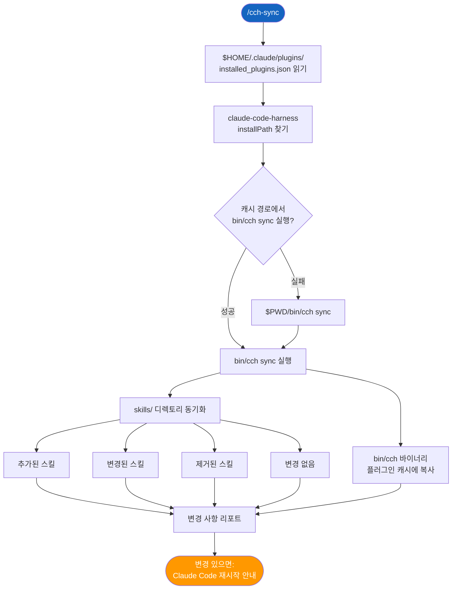
```mermaid
flowchart TD
    START(["/cch-sync"]) --> READ_PLUGINS["$HOME/.claude/plugins/<br/>installed_plugins.json 읽기"]
    READ_PLUGINS --> FIND_PATH["claude-code-harness<br/>installPath 찾기"]

    FIND_PATH --> TRY_CACHE{"캐시 경로에서<br/>bin/cch sync 실행?"}
    TRY_CACHE -->|성공| SYNC["bin/cch sync 실행"]
    TRY_CACHE -->|실패| FALLBACK["$PWD/bin/cch sync"]
    FALLBACK --> SYNC

    SYNC --> COPY_BIN["bin/cch 바이너리<br/>플러그인 캐시에 복사"]
    SYNC --> SYNC_SKILLS["skills/ 디렉토리 동기화"]

    SYNC_SKILLS --> ADDED["추가된 스킬"]
    SYNC_SKILLS --> UPDATED["변경된 스킬"]
    SYNC_SKILLS --> REMOVED["제거된 스킬"]
    SYNC_SKILLS --> UNCHANGED["변경 없음"]

    ADDED & UPDATED & REMOVED & UNCHANGED --> REPORT["변경 사항 리포트"]
    COPY_BIN --> REPORT
    REPORT --> REMIND(["변경 있으면:<br/>Claude Code 재시작 안내"])

    style START fill:#1565C0,color:white
    style REMIND fill:#FF9800,color:white
```

---

## 20. Unified Todo Display

통합 작업 현황 표시 워크플로우.

```mermaid
flowchart LR
    subgraph DataSources["데이터 소스 (우선순위 순)"]
        DS1["1. docs/TODO.md<br/>(SSOT)"]
        DS2["2. .claude/cch/work-items/<br/>(CCH work-items)"]
        DS3["3. docs/Roadmap.md<br/>(마일스톤)"]
        DS4["4. docs/plans/<br/>(실행 계획)"]
        DS5["5. TaskList<br/>(세션 태스크)"]
    end

    subgraph Display["cch-todo 출력"]
        D1["완료 Phase: 요약"]
        D2["진행 Phase: 상세 테이블"]
        D3["예정 Phase: 요약"]
        D4["Work Item 교차 참조"]
        D5["세션 태스크 (있을 경우)"]
        D6["실행 계획 연결"]
        D7["컨텍스트: 마일스톤, 다음 마감,<br/>critical path, 추천 다음 태스크"]
    end

    DS1 --> Display
    DS2 --> Display
    DS3 --> Display
    DS4 --> Display
    DS5 --> Display
```

---

## System Interconnection Diagram

모든 워크플로우 간의 상호 연결 맵.

```mermaid
graph TB
    subgraph UserActions["사용자 액션"]
        UA1["/cch-setup"]
        UA2["/cch-mode"]
        UA3["/cch-commit"]
        UA4["/cch-pr"]
        UA5["/cch-team"]
        UA6["/cch-todo"]
        UA7["/cch-dot"]
        UA8["/cch-pinchtab"]
        UA9["/cch-release"]
        UA10["/cch-sync"]
    end

    subgraph AutoActions["자동 액션 (Hooks)"]
        AA1["mode-detector.sh"]
        AA2["activity-tracker.mjs"]
        AA3["summary-writer.mjs"]
        AA4["plan-doc-reminder.sh"]
        AA5["todo-sync-check.sh"]
    end

    subgraph Engine["Core Engine"]
        ENG_SETUP["Setup"]
        ENG_MODE["Mode"]
        ENG_RESOLVE["Resolve"]
        ENG_DOT["DOT"]
        ENG_WORK["Work Items"]
        ENG_LOG["Log"]
        ENG_TODO["TODO Sync"]
        ENG_SOURCES["Sources"]
        ENG_RELEASE["Release"]
        ENG_UPDATE["Update"]
    end

    subgraph State["State (.claude/cch/)"]
        ST["mode | health | dot_enabled<br/>work-items/ | runs/ | metrics/<br/>sessions/ | last_*"]
    end

    subgraph Policy["Policy (manifests/)"]
        POL["sources.json<br/>capabilities.json<br/>health-rules.json"]
    end

    UA1 --> ENG_SETUP
    UA2 --> ENG_MODE
    UA3 -.-> ENG_WORK
    UA4 -.-> ENG_WORK
    UA5 --> ENG_WORK
    UA6 --> ENG_TODO
    UA7 --> ENG_DOT
    UA9 --> ENG_RELEASE
    UA10 -.-> ENG_SOURCES

    ENG_SETUP --> ENG_SOURCES
    ENG_SETUP --> ENG_RESOLVE
    ENG_MODE --> ENG_RESOLVE
    ENG_DOT --> ENG_RESOLVE
    ENG_RESOLVE --> POL
    ENG_RESOLVE --> ST
    ENG_WORK --> ST
    ENG_LOG --> ST
    ENG_TODO --> ST
    ENG_SOURCES --> POL

    AA1 --> ENG_MODE
    AA2 --> ST
    AA3 --> ST
    AA5 --> ENG_TODO

    HUD["cch-hud.mjs"] --> ST
    HUD --> AA2
    HUD --> AA3

    TESTS["Test Suite<br/>(6 Layers)"] -.-> Engine

    style UserActions fill:#E3F2FD,stroke:#1565C0
    style AutoActions fill:#E8F5E9,stroke:#2E7D32
    style Engine fill:#FFF3E0,stroke:#F57C00
    style State fill:#F3E5F5,stroke:#6A1B9A
    style Policy fill:#FCE4EC,stroke:#C62828
```
